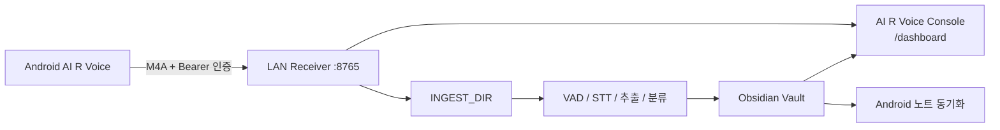
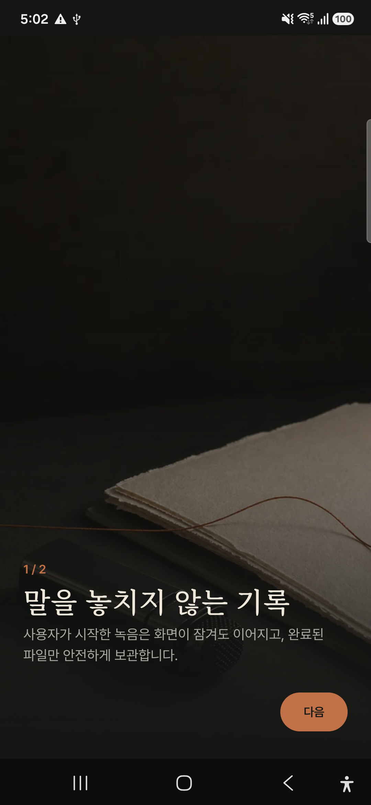
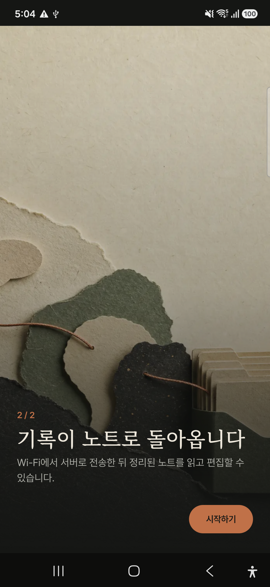
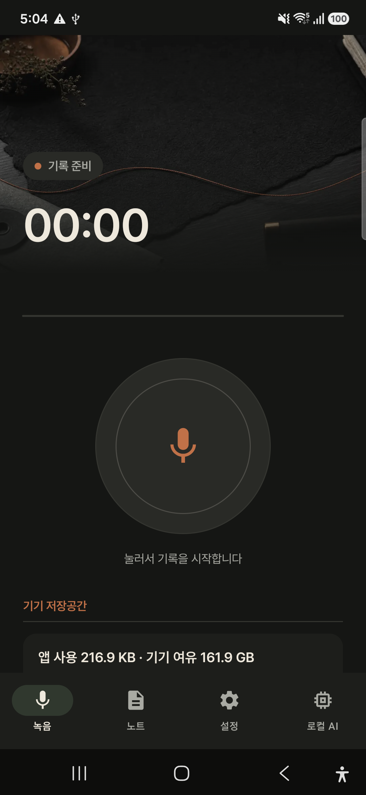
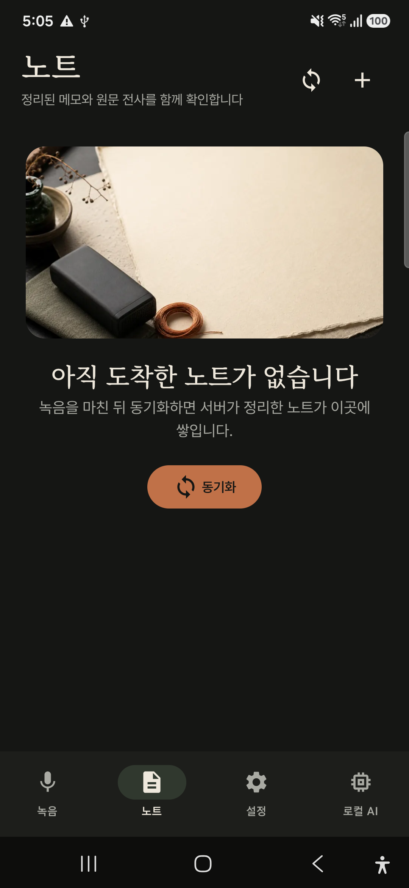
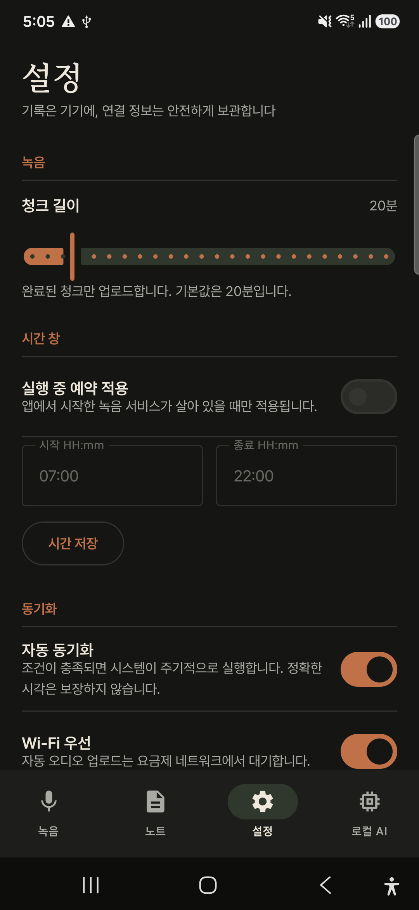
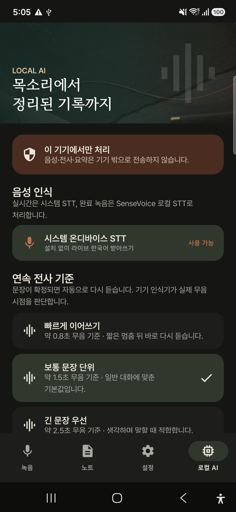

# AI R Voice

**AI R Voice**는 Android 음성 기록 앱과 개인 PC/LAN 수신기, 로컬 AI 처리 파이프라인,
읽기 전용 웹 콘솔을 연결하는 개인 음성 노트 시스템입니다.

```text
Android 녹음 → LAN Receiver → VAD/STT/정리 → Obsidian Vault → Web Console / Android 노트
```

> **설치만 필요한 경우:** [DISTRIBUTE.md](DISTRIBUTE.md)를 먼저 보세요.
> **Windows/Claude 운영 환경:** [SETUP.md](SETUP.md)를 보세요.
> **다른 개발 환경에서 작업 재개:** [HANDOFF.md](HANDOFF.md)를 먼저 읽으세요.

## 현재 상태 — 2026-08-13

| 영역 | 상태 | 비고 |
|---|---|---|
| Android 앱 identity | 완료 | 표시명 `AI R Voice`, release package `com.coreline.ai.voice` |
| Android QA APK | 완료 | `com.coreline.ai.voice.qa`, 버전 `1.0.0-preview` |
| Python 배포/import | 완료 | distribution `ai-r-voice`, import `airvoice` |
| LAN Receiver / Web Console | 완료 | Android·browser 인증 연결 smoke 확인 |
| OAuth 클라우드 요약 구현 | 완료 | Anthropic/Codex/xAI 연결 UI와 typed failure/fallback 경계 포함 |
| 실계정 OAuth 로그인 | 보류 | 소유자 승인 전까지 `DEFERRED_BY_OWNER` |
| Samsung 정식 실기기 QA | 미실행 | 승인된 Samsung 단말 연결 필요 |
| release 서명·스토어 배포 | 미실행 | 배포 credential 미제공 |

최근 PD20에서 최신 QA APK의 update-install, cold start, 메인 화면, Receiver 연결 확인과
OAuth Provider UI를 수동 확인했습니다. 이 검증은 Samsung 전용 QA gate를 대체하지 않습니다.
PD20에는 사용 가능한 마이크 입력이 없어 실제 녹음·전사 smoke는 실행하지 못했습니다.

## 제품 identity와 빌드 variant

| 구분 | application ID | 용도 |
|---|---|---|
| Release | `com.coreline.ai.voice` | 서명된 배포용 |
| Debug | `com.coreline.ai.voice.debug` | 개발용 |
| QA preview | `com.coreline.ai.voice.qa` | 영속 데이터 보존 검증용 |
| Device test | `com.coreline.ai.voice.deviceTest` | instrumentation 격리용 |

- compile/target SDK: **35**, min SDK: **26**
- Kotlin: **1.9.24**, AGP: **8.9.1**, JVM target: **17**
- LiteRT-LM 의존성 때문에 Android 빌드 실행 JDK는 **21 이상**이 필요합니다.
- QA/deviceTest만 로컬 HTTP Receiver QA를 허용합니다. release manifest는 cleartext traffic을
  명시적으로 차단합니다.
- 디버그 Receiver URL은 빈 값이 기본입니다. 개발자 로컬에서만
  `AIRVOICE_DEBUG_SERVER_URL`로 제공할 수 있으며 DHCP IP는 APK에 고정하지 않습니다.

## 시스템 흐름



### Android 앱

| 탭 | 주요 기능 |
|---|---|
| 녹음 | 음성 메모 녹음, 재생, 기기 저장공간 상태 |
| 노트 | Receiver가 공개한 노트·전사 확인, 수동 동기화 |
| 설정 | 녹음 청크, 동기화, LAN Receiver, OAuth 계정 연결 |
| 로컬 AI | 시스템 STT, SenseVoice 파일 STT, Gemma 로컬 요약 |

### 클라우드 요약과 로컬 fallback

OAuth 계정을 활성화하면 **전사 텍스트만** 사용자가 선택한 Provider로 전송합니다. 원본 오디오는
OAuth SDK나 Provider로 전송하지 않습니다.

1. 활성 OAuth profile이 있으면 선택 Provider에 요약을 요청합니다.
2. 성공하면 provider/model/request ID/latency/usage를 기록합니다.
3. `Network`, rate limit, 5xx, timeout 등 fallback 가능한 typed failure에서만 Gemma를 한 번
   실행합니다.
4. `UserCancelled`, `InvalidRequest`는 로컬 fallback 대상이 아닙니다.
5. Provider A 실패 후 Provider B를 자동으로 호출하지 않습니다.

독립 Android OAuth SDK 좌표는 다음과 같습니다.

```text
ai.coreline.oauthllm:oauth-llm-api:0.1.0
ai.coreline.oauthllm:oauth-llm-android:0.1.0
```

공개 client ID와 model 기본값은 추적되는
[`android-app/oauth-llm.defaults.properties`](android-app/oauth-llm.defaults.properties)에 있고,
client secret은 APK나 저장소에 포함하지 않습니다. OAuth 실계정 검증은
[`docs/qa/oauth-llm-e2e-runbook.md`](docs/qa/oauth-llm-e2e-runbook.md)를 따릅니다.

## 앱 미리보기

### 첫 실행 소개

<table>
  <tr>
    <td align="center">
      <br>
      <sub><b>1. 말을 놓치지 않는 기록</b></sub>
    </td>
    <td align="center">
      <br>
      <sub><b>2. 기록이 노트로 돌아오는 흐름</b></sub>
    </td>
  </tr>
</table>

### 주요 탭

<table>
  <tr>
    <td align="center"><br><sub><b>녹음</b></sub></td>
    <td align="center"><br><sub><b>노트</b></sub></td>
    <td align="center"><br><sub><b>설정</b></sub></td>
    <td align="center"><br><sub><b>로컬 AI</b></sub></td>
  </tr>
</table>

## 빠른 시작 — 개발 환경

### 1. Python 환경

```bash
uv venv
uv sync --extra dev --extra server --extra tls
```

실제 오디오 처리와 LLM 분류까지 실행할 경우에는 다음 extras가 필요합니다.

```bash
uv pip install -e ".[audio,llm]"
```

- `audio`: Silero VAD, pydub, faster-whisper
- `llm`: Anthropic API client (`AI_PROVIDER=api`일 때)
- `server`: Cloud API/PostgreSQL/GCS/HTTP2 계약 테스트 의존성
- `tls`: Receiver TLS 인증서 생성 의존성

### 2. `.env` 만들기

`.env.example`을 복사하고 최소한 Receiver token을 설정합니다. `.env`와 token은 Git에 넣지
않습니다.

```bash
cp .env.example .env
python -c "import secrets; print(secrets.token_urlsafe(32))"
```

```dotenv
AI_PROVIDER=claude_cli
INGEST_DIR=~/.airvoice/inbox
OBSIDIAN_VAULT=~/ai-r-voice-vault
RECEIVER_TOKEN=<위에서 생성한 값>
RECEIVER_PORT=8765
RECEIVER_AUTO_PROCESS=1
```

주요 환경변수:

| 변수 | 기본값 | 설명 |
|---|---|---|
| `AI_PROVIDER` | `api` | `api` 또는 로컬 Claude 로그인 기반 `claude_cli` |
| `CLAUDE_API_KEY` | 없음 | `AI_PROVIDER=api`일 때만 필요 |
| `INGEST_DIR` | `~/.airvoice/inbox` | 모바일에서 도착한 오디오 보관 위치 |
| `OBSIDIAN_VAULT` | `~/ai-r-voice-vault` | 정리된 노트 Vault |
| `DB_PATH` | `~/.airvoice/db/pipeline.db` | SQLite 상태 DB |
| `WHISPER_MODEL` | `large-v3` | faster-whisper 모델 |
| `WHISPER_DEVICE` | 자동 | `cuda` 또는 `cpu`로 강제 가능 |
| `RECEIVER_TOKEN` | 없음 | Receiver 시작에 필수인 Bearer token |
| `RECEIVER_PORT` | `8765` | LAN Receiver port |
| `RECEIVER_CERT` | 없음 | TLS PEM 경로. 비어 있으면 HTTP LAN mode |
| `RECEIVER_AUTO_PROCESS` | `1` | 업로드 후 pipeline 자동 실행 여부 |

전체 설명은 [`.env.example`](.env.example)을 기준으로 합니다.

### 3. Receiver와 Web Console 실행

```bash
.venv/bin/python -m airvoice.receiver --host 0.0.0.0 --port 8765
curl http://127.0.0.1:8765/health
# ok
```

같은 LAN의 브라우저에서 다음을 엽니다.

```text
http://<PC-IP>:8765/dashboard
```

대시보드는 public status 페이지와 token 입력 후의 authenticated view로 나뉩니다. token은
브라우저 **sessionStorage**에만 보관하며, 페이지·console·서버 오류 본문에는 출력하지 않습니다.
`/api/v1/dashboard/summary`와 노트·오디오 endpoint는 Bearer 인증이 필요합니다.

> HTTP는 신뢰 가능한 사설 LAN에서만 사용하세요. 외부 네트워크에는 VPN(Tailscale 등)을 사용하거나
> TLS와 앱의 공개키 피닝 구성을 완료해야 합니다.

### 4. Android 앱 연결

1. QA APK `ai-r-voice.apk`를 Android 기기에 설치합니다.
2. **설정 → 서버**에서 다음을 입력합니다.
   - 서버 주소: `http://<PC-IP>:8765`
   - 사용자 ID: 식별용 임의 값
   - Bearer token: `.env`의 `RECEIVER_TOKEN`
3. **저장** 후 **연결 확인**을 누릅니다.
4. `서버와 안전하게 연결되었습니다`가 표시되면 연결이 완료된 것입니다.

PC와 기기가 서로 다른 Wi-Fi에 있으면 LAN IP로 연결되지 않습니다. 개발용 USB 테스트에서만
`adb reverse tcp:8765 tcp:8765`를 사용할 수 있으며, 운영 연결에는 사용하지 않습니다.

Samsung 정식 preview 설치는 승인된 기기만 대상으로 하는 다음 스크립트를 사용합니다.

```bash
cd android-app
./scripts/install_samsung_preview.sh --allow-first-install
./scripts/run_device_qa.sh --case core
```

이 스크립트는 `com.coreline.ai.voice.qa` 데이터의 삭제·초기화를 하지 않으며, instrumentation은
별도 `com.coreline.ai.voice.deviceTest` package에서 실행합니다.

## 실행과 데이터 처리

### Pipeline 수동 실행

```bash
python -m airvoice.main
python -m airvoice.main --force-emerge --date 2026-08-13
```

Windows 환경에서는 [SETUP.md](SETUP.md)의 `.venv\Scripts\python` 및 Scheduled Task 안내를
사용하세요.

### Obsidian Vault 구조

| 경로 | 설명 |
|---|---|
| `10-daily/YYYY-MM-DD.md` | 하루 처리 요약 |
| `20-notes/*.md` | 주제별 노트 |
| `30-ideas/*.md` | 창발 아이디어 노트 |
| `90-archive/*.md` | 전사 아카이브 |
| `_pipeline.md` | 최신 실행 로그 |

### 이전 PC 런타임 데이터 승계

기존 데이터를 삭제하지 않는 copy 방식입니다. 먼저 dry-run을 실행하고, 결과를 확인한 뒤에만
`--apply`를 사용하세요. 새 target이 이미 있으면 자동 병합·overwrite하지 않습니다.

```bash
python -m airvoice.legacy_migration
python -m airvoice.legacy_migration --apply
```

Android의 새 application ID는 별도 sandbox를 사용하므로 기존 앱 private data와 OAuth profile은
자동 승계하지 않습니다.

## 개발·검증

### 전체 Python 검증

```bash
./.venv/bin/python -m pytest --tb=short -q
./.venv/bin/ruff check .
uv lock --check
uv build
```

최근 결과: **645 passed, 14 skipped, 4 deselected**. 실제 Claude 호출, 모델 로딩 등 실물
의존 테스트는 기본 suite에서 제외되며 명시적으로만 실행합니다.

### Android build / unit test / lint

```bash
cd android-app
source scripts/resolve_java_home.sh
airvoice_require_java21
./gradlew --no-daemon \
  :feature-cloud-summary:testDebugUnitTest \
  :feature-ondevice:testDebugUnitTest \
  :app:testDebugUnitTest \
  :app:lintDebug \
  :app:verifyVariantTransportPolicy \
  :app:assembleDevicePreview \
  :app:assembleDeviceTest \
  :app:assembleRelease
```

`verifyVariantTransportPolicy`는 QA/deviceTest의 local HTTP 허용과 release cleartext 차단을
함께 검사합니다. OAuth artifact checksum·notice, native/network boundary, font/raster asset gate도
Gradle build에서 확인됩니다.

### 최근 연결 smoke 결과

| 검증 | 결과 |
|---|---|
| QA APK install/update + cold start | PASS |
| PD20 앱 → 임시 Receiver 연결 확인 | PASS |
| Web Console browser token 인증 | PASS |
| Dashboard API 무인증 / 인증 | 401 / 200 |
| Browser console | error/warning 0건 |
| 앱 runtime crash scan | `FATAL EXCEPTION` 없음 |

테스트는 임시 token과 임시 Receiver에서 수행했으며, 완료 후 token·browser session·USB port
forwarding을 제거했습니다. 증적과 SHA-256은
[리브랜딩 구현·검증 보고서](docs/qa/ai-r-voice-rebrand-implementation-20260813.md)를 보세요.

## 보안·개인정보 원칙

- `RECEIVER_TOKEN`, OAuth access/refresh token, authorization code, PKCE verifier, client secret을
  저장소·APK·공개 API·로그에 노출하지 않습니다.
- Receiver는 token이 비어 있으면 네트워크에 bind하지 않습니다.
- Web Console은 읽기 전용이며 노트·오디오 API는 Bearer token을 요구합니다.
- OAuth cloud summary는 전사 텍스트만 보냅니다. 오디오 원본은 외부 Provider로 보내지 않습니다.
- secret은 `.env`, Android `local.properties`, 환경변수 또는 안전한 secret store에만 둡니다.
- release APK는 아직 unsigned이며 배포 완료 상태가 아닙니다.

## 주요 경로

| 경로 | 역할 |
|---|---|
| `android-app/app` | Android 앱, 녹음·노트·설정 UI, Receiver/OAuth 연결 |
| `android-app/feature-cloud-summary` | OAuth 기반 원격 요약과 typed failure mapping |
| `android-app/feature-ondevice` | SenseVoice/Gemma, 모델 관리, 로컬 fallback |
| `android-app/local-maven` | 독립 proprietary OAuth LLM SDK Maven artifact |
| `src/airvoice` | Python pipeline, LAN Receiver, Cloud API |
| `web/dashboard` | AI R Voice Console 정적 UI |
| `docs/receiver-api-v1.yaml` | Android/Receiver V1 계약 |
| `docs/qa` | QA 보고서와 OAuth 실계정 실행 runbook |
| `scripts/verify_rebrand.py` | 활성 영역의 legacy identity allowlist gate |

## 문서

- [배포용 설치 안내](DISTRIBUTE.md)
- [Windows/Claude 설치 런북](SETUP.md)
- [현재 프로젝트 핸드오프](HANDOFF.md)
- [OAuth 클라우드 요약 통합 문서](android-app/docs/oauth-cloud-summary.md)
- [Receiver API V1](docs/receiver-api-v1.yaml)
- [리브랜딩 구현·검증 보고서](docs/qa/ai-r-voice-rebrand-implementation-20260813.md)
- [OAuth 실계정 E2E runbook](docs/qa/oauth-llm-e2e-runbook.md)

## 아직 완료로 표시하지 않은 항목

- Anthropic/Codex/xAI **실계정** OAuth 로그인·generate E2E
- 승인된 Samsung 기기의 녹음·재생·모델·Room migration instrumentation
- 1시간·2시간 실음원 장기 안정성 시험
- release signing, 스토어 배포, production OAuth registration
- Cloud/GCP staging end-to-end

이 항목들은 자동 테스트 통과와 분리해 관리합니다. 다음 작업자는
[HANDOFF.md](HANDOFF.md)의 재개 순서를 따르세요.
