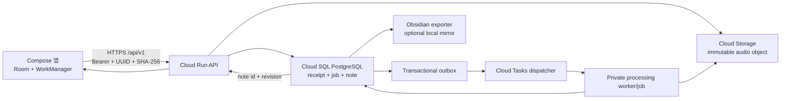

# implement_20260724_081816.md

작성 일시: `2026-07-24 08:18:16 KST`

이 문서는 `com.thinktank.recorder.next`가 원격 서버에 녹음과 노트를 안전하게 연동할 수
있도록 서버 환경과 영속 데이터 계층을 구축하는 범위를 고정한다. 기존 LAN Receiver를
단순히 Cloud Run에 올리지 않고, 현재 V1 계약을 유지하는 persistent adapter와 staging
환경을 별도 작업으로 구현한다.

## 개발 목적

- Android 앱의 녹음 청크를 public-CA HTTPS 서버로 멱등 전송하고 영구 보관한다.
- 업로드 영수증, 처리 상태, 노트 본문·revision을 다중 instance에서도 일관되게 관리한다.
- 업로드 완료 후 VAD → STT → LLM → 노트 생성 작업을 요청 수명과 분리해 재시도 가능하게
  만든다.
- 처리된 노트를 Android에서 조회·생성·수정·보관하고, 기존 Obsidian 사용 흐름은 exporter로
  유지한다.
- GCP staging을 코드와 IaC로 재현하고 운영 전 보안·복구·관측·비용 게이트를 통과한다.

## 개발 범위

- 신규 Compose 앱 `com.thinktank.recorder.next`와 `/api/v1` 데이터 연동
- Cloud Run API, Cloud SQL PostgreSQL, Cloud Storage, Cloud Tasks/비동기 worker
- 업로드 receipt·identity, 처리 job, 노트 revision·archive의 영속 데이터 모델
- 기존 `ReceiverV1State`의 파일/SQLite 책임을 port와 local/cloud adapter로 분리
- 기존 VAD/STT/LLM 파이프라인의 서버 worker 연결
- Secret Manager, 최소 IAM, structured logging, metric/alert, backup/PITR
- Terraform 기반 dev/staging 인프라와 container build/deploy
- Android staging profile, 연결 확인, 업로드·노트·재시도·오류 표시 보강
- 기존 local receipt/vault 데이터의 선택적 1회 migration과 rollback 절차
- Samsung Android 16 실기기 및 staging E2E

## 제외 범위

- 현재 파일·SQLite Receiver를 수정 없이 Cloud Run에 배포
- 기존 `com.thinktank.recorder` private 데이터·설정의 자동 이전
- legacy HTTP API를 공개 인터넷에 그대로 노출
- 앱의 자동 APK 다운로드·설치
- 부팅 후 무인 녹음 시작, watchdog, 전체 저장소 접근
- GCP production 즉시 전환과 24시간 무중단 SLA 보장
- 사용자 승인 전 원본 오디오·노트의 영구 보존
- Obsidian 로컬 폴더의 범용 양방향 실시간 동기화
- Android UI 전면 개편과 서버 연동에 필요하지 않은 기능 추가

## 참조 문서

- [Android 운영 완성도 후속 계획](implement_20260724_075651.md)
- [Android 전체 구현 계획](implement_20260723_201248.md)
- [GCP Cloud Run 전환 준비도](../docs/gcp-cloud-run-readiness-2026-07-23.md)
- [서버 연동 Phase 0 결정 초안](../docs/server-phase0-decision-draft.md)
- [Receiver V1 OpenAPI](../docs/receiver-api-v1.yaml)
- [Cloud API runtime](../docs/cloud-api-runtime.md)
- [Android V1 제품 결정 기록](../docs/phase0-decision-record.md)
- [최종 QA 보고서](../docs/qa/final-qa-report-2026-07-23.md)
- [설치 런북](../SETUP.md)
- [배포 안내](../DISTRIBUTE.md)
- [Cloud Run container contract](https://cloud.google.com/run/docs/container-contract)
- [Cloud Run quotas](https://cloud.google.com/run/quotas)
- [Cloud SQL PostgreSQL에서 Cloud Run 연결](https://cloud.google.com/sql/docs/postgres/connect-run)
- [Cloud Storage request preconditions](https://cloud.google.com/storage/docs/request-preconditions)
- [Cloud Tasks HTTP target 인증](https://cloud.google.com/tasks/docs/creating-http-target-tasks)

## 공통 진행 규칙

- 각 Phase는 앞선 Phase의 자체 테스트 완료 후에만 시작한다.
- Phase 0 결정 전 실제 cloud resource를 생성하지 않는다.
- 구현 중 발견한 계약 차이는 Android와 서버 fixture를 함께 수정하고 OpenAPI를 정본으로 갱신한다.
- local SQLite/file adapter 회귀를 유지해 LAN Receiver를 깨지 않는다.
- DB migration은 forward/rollback 또는 restore 절차를 갖추고 destructive migration을 금지한다.
- object/DB/task 사이 모든 실패 지점을 멱등 상태 전이와 보상 작업으로 처리한다.
- token, API key, DB password, 운영 URL, 실제 녹음·노트 본문을 저장소와 CI 로그에 남기지 않는다.
- Terraform plan은 검토 후 apply하며 staging과 production state를 분리한다.
- 비용·보존·삭제 정책이 승인되지 않으면 production resource를 만들지 않는다.
- 실제 사용자 데이터를 쓰기 전에 합성 fixture로 staging E2E와 복구 drill을 완료한다.

## 계획 기준안

- 기존 GCP 준비도 문서와 Android의 public-CA HTTPS 제약을 근거로 **GCP staging**을
  기본 대상으로 한다.
- 이 계획의 작성은 cloud resource 생성 권한을 의미하지 않는다. 실제 생성은 Phase 0의
  project·billing·region·보존 정책 승인 뒤에만 수행한다.
- 단일 PC LAN/VPN Receiver만 확장하려는 경우에는 이 계획의 Cloud SQL/Storage/Tasks
  범위를 적용하지 않고 별도 경량 계획을 만든다.

## 기존 프로젝트 분석 결과

| 영역 | 현재 상태 | 서버 구축 영향 |
|---|---|---|
| Android 업로드 | Room queue → WorkManager → `PUT /api/v1/upload` | UUID·SHA-256·receipt 전체 일치 계약은 유지한다. |
| Android 보안 | release HTTPS 강제, Bearer token은 Android Keystore AES-GCM | staging도 public-CA HTTPS를 사용하고 token을 로그에 남기지 않는다. |
| Android 설정 | 연결 시험 전에 새 URL/token을 저장함 | 연결 실패가 정상 설정을 덮지 않도록 임시 profile 검증 후 commit한다. |
| 오디오 MIME | 모든 파일을 `audio/mp4`로 전송 | M4A/WAV 실제 형식별 Content-Type 계약을 맞춘다. |
| Receiver HTTP | stdlib `ThreadingHTTPServer`, 로컬 파일 stream | Cloud Run용 API framework와 storage streaming adapter가 필요하다. |
| 업로드 저장 | `INGEST_DIR` 임시 파일 → `os.replace` | Cloud Storage immutable object와 generation precondition으로 교체한다. |
| receipt ledger | 단일 SQLite WAL | PostgreSQL unique constraint와 transaction으로 교체한다. |
| 노트 저장 | Markdown 파일 + SQLite identity | 서버 정본은 PostgreSQL 본문/revision으로 전환한다. |
| 처리 trigger | process 내부 `threading.Timer` 후 subprocess | DB outbox와 인증된 비동기 dispatcher/worker로 교체한다. |
| 처리 파이프라인 | 로컬 경로·SQLite·Obsidian 파일 중심 | 입력 object와 note store를 port로 분리한다. |
| 다중 사용자 | token으로 사용자 결정, 사용자별 경로 분리 | path `userId`는 검증값으로만 쓰고 token 소유자를 권한 정본으로 유지한다. |
| API 품질 | V1 HTTP 회귀와 Android MockWebServer 존재 | 동일 fixture를 local/cloud adapter conformance suite로 승격한다. |
| 배포 기반 | Dockerfile, migration, IaC, CI deploy 없음 | container·Alembic·Terraform·staging workflow를 새로 만든다. |
| 운영 문서 | `SETUP.md`는 로컬 HTTP·Windows 전제를 포함 | 신규 Compose cloud 절차와 legacy LAN 절차를 분리한다. |

## 목표 데이터 흐름

## 데이터 정본과 상태 계약

### Cloud SQL 정본

- `users`: 서버 사용자 ID, 상태, 생성 시각. path의 user ID가 아니라 token 소유자가 권한 정본이다.
- `api_tokens`: 사용자, token hash/HMAC, 버전, 만료·폐기 시각, 마지막 사용 시각. 원문 token은
  DB와 로그에 저장하지 않는다.
- `upload_receipts`: `upload_id`, idempotency key, recording/chunk ID, filename, content type,
  size, SHA-256, object key/generation, 상태와 시각.
- `processing_jobs`: receipt별 `QUEUED/RUNNING/SUCCEEDED/RETRY/FAILED`, attempt, lease,
  오류 code, worker execution ID.
- `outbox_events`: receipt transaction과 함께 기록하고 dispatcher가 멱등 발행한다.
- `notes`: 안정적인 note ID, user/folder/name/content/revision, created/updated/archived 시각.
- `note_events` 또는 동등 tombstone: archive와 향후 증분 동기화에서 서버 삭제를 구분한다.
- `schema_migrations`: Alembic revision과 배포 호환 범위를 기록한다.

### Cloud Storage 정본

- object key는 `users/{userId}/recordings/{recordingId}/{chunkId}/{sha256}.{ext}` 형식으로
  결정적이며 사용자 제공 filename을 경로로 직접 사용하지 않는다.
- 신규 object는 generation-match `0` 조건으로 생성해 같은 key를 덮어쓰지 않는다.
- object metadata에 receipt/recording/chunk ID, SHA-256, content type을 기록한다.
- DB receipt에는 object generation을 저장하고 이후 read/delete도 generation 조건을 사용한다.
- lifecycle 삭제는 처리 성공·receipt hash 일치·승인된 보존 기간을 모두 만족할 때만 수행한다.

### 외부 API 호환

- 현재 `/api/v1/health`, upload, notes CRUD/archive, APK info 응답 shape와 오류 envelope를 유지한다.
- upload wire status는 `created` 또는 `already_exists`만 반환한다.
- 같은 idempotency key 또는 recording/chunk identity에 다른 hash가 오면 `409`로 거부한다.
- object 저장과 receipt/outbox transaction 사이에는 분산 transaction을 시도하지 않고,
  matching orphan object를 안전하게 승계하는 보상 절차를 구현한다.
- 노트 수정은 `If-Match`와 SHA-256 revision을 사용하고 동시 수정자는 정확히 하나만 성공한다.

## 문서 기반 제약 사항

- Cloud Run container filesystem은 영속 저장소로 사용하지 않는다.
- Cloud Run에서는 TLS를 container에서 다시 종료하지 않고 platform TLS를 사용한다.
- API container는 주입된 `PORT`에서 `0.0.0.0`으로 수신한다.
- Cloud Run HTTP/1 request는 32 MiB 상한이 있으므로 120분 AAC와 PCM fallback을
  검증 없이 직접 upload endpoint에 허용하지 않는다.
- Cloud SQL과 Cloud Run은 승인된 동일 region을 우선 사용한다.
- Cloud Tasks → worker 호출은 OIDC와 전용 service account로 인증한다.
- API 성공 응답 전에 object hash/size와 receipt identity가 영속 상태로 확정돼야 한다.
- STT/LLM 실행은 API request 안에서 수행하지 않는다.
- `claude_cli`의 사용자 로그인 세션을 무인 cloud worker 인증 수단으로 사용하지 않는다.
- legacy LAN Receiver는 cloud adapter 안정화 전 제거하지 않는다.

## 확인 필요 사항 / 결정 기록

- [ ] GCP project, billing owner, staging/production 분리 방식을 승인한다.
- [ ] region과 데이터 저장 국가, Cloud SQL/Storage/Tasks 동일 region 사용 여부를 승인한다.
- [ ] 원본 오디오·전사·노트·archive의 보존 기간과 사용자 삭제 정책을 승인한다.
- [ ] staging domain과 production domain, DNS 소유자와 public CA 방식을 승인한다.
- [ ] cloud worker의 AI 인증은 `AI_PROVIDER=api`를 기본안으로 승인한다.
- [ ] VAD/STT worker의 CPU/GPU runtime과 5/20/120분 처리 시간·비용 상한을 승인한다.
- [ ] 업로드 구현은 **기존 V1 direct streaming + Cloud Run h2c**를 우선 PoC한다.
- [ ] 32 MiB 초과 실제 업로드가 buffering 없이 통과하지 않으면 direct GCS resumable
  `init → upload → commit` 계약으로 전환하고 OpenAPI/Android 변경을 별도 승인한다.
- [ ] 노트 정본은 PostgreSQL, Obsidian은 단방향 exporter mirror로 운영하는 기준안을 승인한다.
- [ ] exporter가 감지한 로컬 Obsidian 수정은 덮어쓰지 않고 conflict 보고로 보존하며,
  양방향 편집이 필요하면 별도 bridge 작업으로 분리한다.
- [ ] 기존 local receipt/vault에 운영 데이터가 없으면 migration을 zero-state로 종료한다.

## 예상 변경 파일 / 영향 범위

- `src/thinktank/receiver.py`, `receiver_v1.py`: HTTP와 local persistence 책임 분리
- `src/thinktank/server/`: cloud API, auth, service, repository port
- `src/thinktank/adapters/`: PostgreSQL, Cloud Storage, outbox/Tasks adapter
- `src/thinktank/worker/`: receipt claim, pipeline 실행, 상태 전이
- `src/thinktank/notes/`, `main.py`, `ingest.py`: object input와 note store port 연결
- `migrations/` 또는 `alembic/`: PostgreSQL schema migration
- `Dockerfile.api`, `Dockerfile.worker`, container entrypoint
- `infra/gcp/`: Terraform dev/staging resource와 IAM
- `docs/receiver-api-v1.yaml`: 실제 wire contract와 오류/size 정책
- `android-app/.../ReceiverApi.kt`: MIME, 응답 상한, request ID, 필요 시 upload v1.1
- `AppPreferences.kt`, `SettingsViewModel`, `SyncRepository`: profile commit과 오류 상태
- Python contract/integration test, Android MockWebServer/instrumented test
- `SETUP.md`, `DISTRIBUTE.md`, QA·운영 runbook

## Phase 상태 요약

- [ ] Phase 0. 서버·데이터·비용 결정
- [x] Phase 1. V1 계약 고정과 persistence port 분리
- [x] Phase 2. PostgreSQL·Cloud Storage 영속 adapter
- [ ] Phase 3. Cloud API·인증·대용량 upload PoC (local/container 완료, 실제 Cloud Run 실측 대기)
- [ ] Phase 4. 비동기 처리 worker와 노트 정본 연결
- [ ] Phase 5. GCP IaC·staging 배포·관측/복구
- [ ] Phase 6. Android staging 데이터 연동
- [ ] Phase 7. migration·통합 QA·cutover 준비

### 2026-07-24 구현 체크포인트

- Phase 0 미확정값과 resource apply 금지 조건을
  `docs/server-phase0-decision-draft.md`에 분리했다.
- `ReceiverV1State` 파일/SQLite 구현을 `LocalReceiverV1Adapter`로 이동하고
  `ReceiverV1Persistence` 주입 경계 및 4개 cloud persistence port를 추가했다.
- matching orphan·receipt conflict 판정을 순수 domain service로 분리했다.
- OpenAPI 3.1 validator와 중복 YAML key, server/Android status·MIME·size drift gate를
  기본 Python 회귀에 추가했다.
- Android는 후보 서버 설정의 health+인증 probe 성공 후 commit하고, 확장자별 MIME과
  Content-Length가 없는 JSON의 실제 byte 상한도 적용한다.
- 검증 결과: Ruff 통과, Python `582 passed / 4 skipped / 4 deselected`, Android
  debug unit `27 passed`, Samsung SM-S931N Android 16 instrumentation `3 passed`.
- GCP project·billing·region·domain·보존 정책은 미확정이며 cloud resource는 생성하지 않았다.

### 2026-07-24 Phase 2 구현 체크포인트

- SQLAlchemy schema와 Alembic initial migration에 users/token digest, upload receipt,
  processing job, transactional outbox, note/tombstone을 구현했다.
- PostgreSQL receipt·job·outbox는 한 transaction에서 commit하며, note update/archive는
  revision 조건 UPDATE와 active partial unique index를 사용한다.
- GCS adapter는 staging object를 stream/hash 검증한 뒤 generation-match `0`으로
  immutable key에 promote하고, matching orphan과 precondition race를 구분한다.
- 24시간 age gate와 object generation 조건을 사용하는 orphan sweeper가 receipt에
  참조되지 않은 오래된 final/staging object만 보상 삭제한다.
- Cloud Tasks publisher는 outbox event UUID 기반 deterministic task name, OIDC service
  account와 duplicate-create 성공 처리를 사용한다.
- Mac mini의 임시 PostgreSQL 17에서 migration up/down/up, 20개 병렬 upload/note,
  object 성공·DB 실패 복구, outbox rollback·재발행, 사용자 격리를 검증했다.
- 전체 결과는 Ruff 통과, Python `604 passed / 4 skipped / 4 deselected`다.
- 실제 GCS/Cloud Tasks/GCP resource는 생성하지 않았으며 staging 호출 검증은 Phase 3/5에 남긴다.

### 2026-07-24 Phase 3 local/container 구현 체크포인트

- Starlette ASGI Cloud API에 V1 health/readiness, upload, notes CRUD/archive와 cloud APK
  404 경계를 구현하고 Hypercorn을 `0.0.0.0:$PORT` h2c·SIGTERM graceful shutdown으로
  연결했다. container 내부 TLS 인증서 설정은 사용하지 않는다.
- async request stream과 기존 sync GCS adapter 사이에 256KiB 단위, 기본 4-slot bounded
  queue bridge를 두어 upload body를 전체 memory/temp filesystem에 적재하지 않는다.
- HMAC token digest를 단일 PostgreSQL `UPDATE ... RETURNING`으로 활성 사용자에 resolve하고,
  path user 불일치는 403으로 차단하며 last-used와 token issue/revoke 관리 경계를 추가했다.
- requestId·Cloud Trace를 구조화 JSON log에 연결하고 Authorization, token, body, signed URL,
  미처리 exception message를 log payload에 넣지 않는다.
- DB pool은 기본 5+2, instance budget 7로 제한하고 초과 설정은 기동 전에 거부한다.
- OpenAPI에 readiness, 403/415와 retryable 429/503/504 envelope·`Retry-After`를 반영했다.
- `Dockerfile.api`는 API 전용 최소 dependency extra, UID/GID 65532, read-only 실행을 사용한다.
  Mac mini에서 Cloud Run용 `linux/amd64` image(약 72.6MB)를 교차 빌드하고 import smoke를
  통과했다.
- 실제 h2c prior-knowledge 요청과 4/28/40MiB 합성 upload가 local PoC에서 통과했고 queue
  peak는 설정 상한(5×256KiB 이하)을 유지했다.
- 임시 PostgreSQL 17을 포함한 최종 결과는 Ruff·diff check 통과, Python
  `625 passed / 4 skipped / 4 deselected`다. 테스트용 PostgreSQL container는 제거했다.
- GCP project·billing·region·domain이 미확정이므로 실제 Cloud Run/GCS/Cloud SQL resource와
  4/28/40MiB Cloud Run 수치 측정은 수행하지 않았다.

## QA 관점

- [ ] object 성공/DB 실패, DB 성공/task 실패, worker 성공/응답 유실을 각각 주입한다.
- [ ] 동일 upload 20개 병렬 요청에서 object·receipt·job이 정확히 하나인지 확인한다.
- [ ] 같은 recording/chunk에 다른 hash, 같은 filename에 다른 identity를 409로 차단한다.
- [ ] 5/20/120분 AAC와 PCM fallback의 실제 크기·시간·재시도를 검증한다.
- [ ] Android가 401/409/412/413/422/429/5xx/timeout을 올바른 terminal/retry 상태로 저장한다.
- [ ] token 폐기·rotation 중 신규/구 token 허용 창과 사용자 격리를 확인한다.
- [ ] 노트 동시 수정·archive·재시도에서 본문과 tombstone이 유실되지 않는지 확인한다.
- [ ] Cloud SQL failover/connection reset, worker 중복 실행, task redelivery를 검증한다.
- [ ] 로그·trace·metric에 token, 노트 본문, 오디오 object signed URL이 노출되지 않는지 확인한다.
- [ ] backup/PITR와 object generation 기반 복구를 별도 staging에서 실제 수행한다.
- [ ] legacy LAN Receiver와 cloud adapter가 공통 OpenAPI fixture에 같은 의미로 응답하는지 확인한다.

## Phase 0. 서버·데이터·비용 결정

### 목표

resource 생성 전에 운영 위치, 보존, AI worker, upload 경로와 cutover 원칙을 확정한다.

### 구현 태스크

- [ ] project/region/environment naming과 resource owner를 결정 기록에 남긴다.
- [ ] staging과 production의 Cloud SQL·bucket·service account·secret·Terraform state를 분리한다.
- [ ] 오디오·전사·노트별 보존, archive, 사용자 삭제, backup 보존 정책을 확정한다.
- [ ] 월간 녹음 시간·사용자 수·평균 청크를 기준으로 Run/SQL/Storage/Tasks/STT/LLM 예산을 산정한다.
- [ ] Cloud SQL staging은 최소 사양, production은 HA/PITR 필요성을 데이터 중요도에 따라 승인한다.
- [ ] cloud worker는 Anthropic API 방식, local transitional worker는 별도 범위로 결정한다.
- [ ] direct h2c upload PoC 실패 시 resumable upload 계약으로 전환하는 수치 기준을 확정한다.
- [ ] legacy 앱은 LAN에 유지하고 신규 Compose V1만 cloud cutover하는 기본안을 승인한다.
- [ ] 개인정보 안내에 원본 오디오·전사·LLM 전송·보존·삭제 범위를 명시한다.

### 자체 테스트

- [ ] 모든 resource가 승인된 region과 environment label에 매핑되는지 표로 검토한다.
- [ ] 1일/30일/1년 예상 object·DB·AI 비용을 저/기준/고 사용량으로 계산한다.
- [ ] 보존·삭제 정책이 Android 로컬 보존과 server lifecycle에서 충돌하지 않는지 확인한다.
- [ ] cloud worker가 사용자 interactive login 없이 기동 가능한 인증 경로인지 검증한다.

### 이슈 및 수정

- [ ] billing, region, 보존, AI provider 중 하나라도 미승인이면 Phase 1 이후 resource apply를 금지한다.

### 완료 조건

- [ ] 결정 기록이 승인됐다.
- [ ] 자체 테스트가 완료됐다.
- [ ] Phase 1 진행이 가능하다.

## Phase 1. V1 계약 고정과 persistence port 분리

### 목표

HTTP 의미를 바꾸지 않고 local 파일/SQLite 구현과 cloud 구현이 같은 domain 계약을 사용하게 한다.

### 구현 태스크

- [x] OpenAPI를 lint/validate하고 서버 응답·Android fixture와 자동 diff하는 계약 gate를 추가한다.
- [x] upload receipt status, error code, ETag, requestId, MIME과 최대 크기를 명시한다.
- [x] `UploadStore`, `ReceiptRepository`, `NoteRepository`, `JobOutbox` 최소 port를 정의한다.
- [x] `ReceiverV1State`의 SQLite/file 코드를 local adapter로 이동하되 public 동작은 유지한다.
- [x] HTTP handler는 인증·입력 검증·status mapping만 담당하고 storage 구현을 직접 알지 않게 한다.
- [x] matching orphan 승계와 conflict 판정을 domain service로 분리한다.
- [x] 기존 582 Python 회귀와 V1 HTTP 병렬 테스트를 유지하고 핵심
  idempotency/conflict/revision을 port conformance fixture로 재사용한다.
- [x] Android MockWebServer fixture의 `stored`/`created` 상태 불일치를 실제 wire 계약으로 정리한다.

### 자체 테스트

- [x] local adapter가 기존 upload/notes/APK V1 테스트를 모두 통과한다.
- [x] legacy endpoint 회귀 결과가 변경되지 않는다.
- [x] fake cloud adapter에서도 동일 idempotency/conflict/revision fixture가 통과한다.
- [x] OpenAPI parser와 schema validator가 기본 test gate에서 오류·중복 key·미문서 응답을 차단한다.

### 이슈 및 수정

- [ ] refactor 중 wire response가 달라지면 Android 변경으로 우회하지 않고 계약 차이를 먼저 기록한다.

### 완료 조건

- [x] persistence port와 local adapter가 구현됐다.
- [x] 계약·회귀 테스트가 통과했다.
- [x] Phase 2 진행이 가능하다.

## Phase 2. PostgreSQL·Cloud Storage 영속 adapter

### 목표

다중 Cloud Run instance에서도 upload identity와 노트 revision이 유실·중복되지 않게 한다.

### 구현 태스크

- [x] PostgreSQL schema와 Alembic initial migration을 작성한다.
- [x] 현재 SQLite unique 제약을 PostgreSQL에 동일하게 구현한다.
- [x] token 원문 대신 hash/HMAC와 rotation metadata를 저장한다.
- [x] object key 정규화, extension/MIME allowlist, generation-match `0` upload를 구현한다.
- [x] stream 중 SHA-256·size를 계산하고 선언값 불일치는 object/receipt 없이 422로 종료한다.
- [x] object 성공 후 receipt+outbox를 한 DB transaction으로 commit한다.
- [x] object 성공/DB 실패 orphan은 동일 identity 재요청에서 metadata/hash 일치 시 승계한다.
- [x] outbox publisher는 deterministic task name으로 중복 발행을 멱등 처리한다.
- [x] notes create/update/archive를 row lock 또는 revision 조건 update로 구현한다.
- [x] archive tombstone과 active `(user, folder, name)` uniqueness를 구현한다.

### 자체 테스트

- [x] ephemeral PostgreSQL에서 migration up/down/up 절차를 검증한다.
- [x] 20개 병렬 동일 upload에서 object·receipt·job·outbox가 각각 하나다.
- [x] object/DB/outbox 각 commit 경계의 장애 주입 후 재실행이 같은 상태로 수렴한다.
- [x] GCS precondition 412를 동일 content replay와 다른 content conflict로 정확히 구분한다.
- [x] 동시 note update 20건에서 하나만 성공하고 나머지는 412다.
- [x] user A scope에서 user B object key/receipt/note/token digest를 읽거나 변경할 수 없다.

### 이슈 및 수정

- [x] GCS와 SQL을 하나의 transaction처럼 가장하지 않고 matching orphan,
  age/generation 제한 orphan sweeper와 outbox로 보상한다.

### 완료 조건

- [x] cloud persistence adapter와 migration이 구현됐다.
- [x] 장애·동시성 테스트가 통과했다.
- [x] Phase 3 진행이 가능하다.

## Phase 3. Cloud API·인증·대용량 upload PoC

### 목표

Cloud Run container contract와 Android V1 wire contract를 동시에 만족하는 stateless API를 만든다.

### 구현 태스크

- [x] Cloud API entrypoint를 만들고 `0.0.0.0:$PORT`, graceful shutdown, health/readiness를 구현한다.
- [x] platform TLS 뒤에서만 동작하고 container 자체 인증서 설정을 cloud profile에서 금지한다.
- [x] Bearer token으로 사용자를 resolve하고 path userId 불일치를 401/403으로 차단한다.
- [x] requestId·Cloud Trace correlation과 redacted structured JSON logging을 구현한다.
- [x] DB pool 상한을 Cloud Run max instance/concurrency와 Cloud SQL connection 예산에 맞춘다.
- [x] h2c 지원 server로 body를 buffering하지 않고 GCS에 streaming하는 PoC를 구현한다.
- [ ] 4MiB, 28MiB, 40MiB 이상 합성 오디오 upload를 실제 Cloud Run에서 측정한다.
- [ ] PoC 실패 시 V1 direct upload를 억지로 유지하지 않고 resumable `init/commit` 계약으로 전환한다.
- [x] 401/409/411/413/415/422/429/507/5xx 오류 envelope와 `Retry-After` 정책을 고정한다.
- [x] API container를 non-root, read-only 가능한 설정, 최소 runtime dependency로 만든다.

### 자체 테스트

- [ ] cold start와 scale-out 중 health, upload, note read가 성공한다.
- [x] local 4/28/40MiB에서 request body가 memory/temp filesystem에 전체 buffering되지 않는지 측정한다.
- [ ] 실제 Cloud Run 4/28/40MiB에서 memory·latency·ingress 동작을 측정한다.
- [ ] Android OkHttp에서 5/20/120분 AAC와 32MiB 초과 fixture가 승인 경로로 동작한다.
- [x] 잘못된 token, user path, hash, MIME, filename, Content-Length를 거부한다.
- [x] 로그에 Authorization, token, note content, signed URL이 없다.
- [x] local disconnect/request timeout이 receipt를 commit하지 않고 고정 오류 envelope로 종료된다.
- [ ] 실제 Cloud Run SIGTERM/request timeout에서 GCS staging object와 열린 DB transaction이 남지 않는다.

### 이슈 및 수정

- [ ] 대용량 PoC 결과와 선택한 upload 계약을 OpenAPI와 Android 계획에 즉시 반영한다.

### 완료 조건

- [ ] 실제 Cloud Run upload 경로가 수치 기준을 통과했다.
- [x] local/container 보안·관측·오류 계약 테스트가 통과했다.
- [ ] Phase 4 진행이 가능하다.

## Phase 4. 비동기 처리 worker와 노트 정본 연결

### 목표

업로드 요청과 VAD/STT/LLM 처리를 분리하고 중복 실행에도 노트 결과가 한 번만 확정되게 한다.

### 구현 태스크

- [ ] receipt commit과 같은 transaction에 처리 outbox를 기록한다.
- [ ] Cloud Tasks가 OIDC로 private dispatcher를 호출하고 dispatcher는 빠르게 worker/job을 시작한다.
- [ ] worker는 receipt ID로 job을 claim하고 lease/heartbeat/attempt를 갱신한다.
- [ ] Cloud Storage object를 generation 조건으로 읽어 SHA-256을 재검증한다.
- [ ] 기존 ingest/VAD/STT/extract pipeline이 file path 대신 recording input port를 받게 분리한다.
- [ ] pipeline 결과 note write를 PostgreSQL `NoteRepository`로 연결한다.
- [ ] 동일 job 재실행은 이미 확정된 segment/note revision을 중복 생성하지 않는다.
- [ ] retryable AI/network 오류와 permanent media/contract 오류를 분리한다.
- [ ] dead-letter/FAILED job의 재실행 action과 최대 attempt를 구현한다.
- [ ] Obsidian exporter는 DB note를 로컬 Markdown으로 원자적 반영하고, 로컬 수정이 감지되면
  덮어쓰지 않고 conflict 사본과 진단 상태를 남긴다.

### 자체 테스트

- [ ] task 중복 전달·worker 강제 종료·lease 만료 후 하나의 최종 결과로 수렴한다.
- [ ] 손상 오디오, VAD 0 segment, STT timeout, LLM 429/5xx를 상태표대로 처리한다.
- [ ] 처리 성공 후 Android note list에 동일 note가 한 번만 노출된다.
- [ ] worker가 5/20/120분 representative 파일을 승인 시간·메모리·비용 안에서 처리한다.
- [ ] Obsidian export 재실행이 사용자 로컬 파일을 조용히 유실시키지 않는다.

### 이슈 및 수정

- [ ] 30분을 넘는 작업을 Cloud Tasks HTTP handler 안에서 기다리지 않고 worker/job 실행으로 분리한다.

### 완료 조건

- [ ] upload → async process → note 생성이 멱등하게 동작한다.
- [ ] worker 장애·재시도 테스트가 통과했다.
- [ ] Phase 5 진행이 가능하다.

## Phase 5. GCP IaC·staging 배포·관측/복구

### 목표

빈 project에서도 검토 가능한 plan과 승인된 apply로 staging을 재현하고 복구 가능하게 한다.

### 구현 태스크

- [ ] Terraform에 API enablement, Artifact Registry, Run API/worker, SQL, bucket, Tasks,
  Secret Manager, service account와 IAM을 선언한다.
- [ ] API/worker/migration/deploy service account를 분리하고 최소 역할만 부여한다.
- [ ] bucket public access prevention, uniform access, lifecycle/retention을 설정한다.
- [ ] Cloud SQL backup, PITR, deletion protection와 maintenance 정책을 staging 기준으로 설정한다.
- [ ] secret version을 image/env/Terraform state에 평문으로 남기지 않는 주입 방식을 구현한다.
- [ ] CI에 test → contract → image scan/build → migration check → Terraform plan → 승인 deploy를 추가한다.
- [ ] structured log 기반 upload 실패율, queue age, FAILED job, SQL connection, storage 오류 metric을 만든다.
- [ ] alert threshold와 운영 runbook, token rotation, rollback, secret compromise 절차를 작성한다.
- [ ] staging custom domain/public CA와 Android에서 사용할 base URL을 발급한다.

### 자체 테스트

- [ ] clean project 또는 격리 환경에서 Terraform plan이 재현되고 두 번째 apply가 no-op이다.
- [ ] API service account가 다른 user object와 secret admin 권한을 갖지 않는다.
- [ ] Cloud SQL backup restore/PITR를 별도 staging instance로 실제 수행한다.
- [ ] service revision rollback 후 schema backward compatibility가 유지된다.
- [ ] queue 적체·DB 중단·bucket 권한 제거 alert가 발생하고 runbook으로 복구된다.
- [ ] budget alert와 log retention이 승인값과 일치한다.

### 이슈 및 수정

- [ ] console 수동 변경은 drift로 기록하고 Terraform에 반영하거나 원복한다.

### 완료 조건

- [ ] staging 인프라와 배포 pipeline이 재현 가능하다.
- [ ] 관측·backup·rollback drill이 통과했다.
- [ ] Phase 6 진행이 가능하다.

## Phase 6. Android staging 데이터 연동

### 목표

Samsung 실기기에서 staging 서버의 upload·처리·노트 흐름과 장애 복구를 검증한다.

### 구현 태스크

- [ ] dev/staging/release 서버 profile을 분리하고 secret URL/token을 APK에 hard-code하지 않는다.
- [x] 연결 확인은 임시 설정으로 health+인증 note 호출을 통과한 뒤에만 기존 설정을 교체한다.
- [x] M4A는 `audio/mp4`, WAV fallback은 `audio/wav`로 전송한다.
- [x] 실제 읽은 JSON byte 상한을 Content-Length 유무와 무관하게 적용한다.
- [ ] `Retry-After`와 server error code를 WorkManager retry/terminal 상태로 매핑한다.
- [ ] upload 응답 receipt의 identity·hash·size·status 전체 일치를 계속 강제한다.
- [ ] server profile 변경 시 기존 READY/RETRY 청크의 destination 정책을 명시하고 오전송을 막는다.
- [ ] sync 결과에서 upload 성공과 note 실패를 동시에 보존하고 성공으로 덮지 않는다.
- [ ] requestId를 사용자 진단에 노출하되 token·파일 경로·본문은 숨긴다.
- [ ] 필요 시 Phase 3에서 승인된 resumable upload client를 구현한다.

### 자체 테스트

- [ ] Samsung Android 16에서 연결 저장, 실제 녹음, upload, 처리, note 조회·수정·archive를 완료한다.
- [ ] Wi-Fi↔LTE/VPN 전환, offline, 401, 409, 413, 422, 429, 5xx 후 Room 상태가 수렴한다.
- [x] 실패한 연결 시험이 기존 정상 URL/token을 덮어쓰지 않는다.
- [ ] M4A와 WAV 요청 Content-Type·size·SHA-256이 server receipt와 일치한다.
- [ ] 앱 재시작·WorkManager 중복 실행에서 같은 청크가 서버에 한 번만 확정된다.
- [ ] token rotation 허용 창과 폐기 후 재인증 안내가 정확하다.

### 이슈 및 수정

- [x] USB ADB 재연결 이슈는 서버 기능 실패와 분리하고 고정 Samsung 스크립트를 사용한다.

### 완료 조건

- [ ] 실기기 staging 데이터 연동이 통과했다.
- [ ] Android 오류·재시도 상태가 서버 계약과 일치한다.
- [ ] Phase 7 진행이 가능하다.

## Phase 7. migration·통합 QA·cutover 준비

### 목표

기존 데이터를 유실 없이 선택적으로 이전하고 production 승인 전 end-to-end와 rollback을 검증한다.

### 구현 태스크

- [ ] local SQLite receipt, ingest audio, vault Markdown의 실제 데이터 inventory를 생성한다.
- [ ] zero-state면 migration 생략 기록을 남기고, 데이터가 있으면 checksum manifest를 만든다.
- [ ] receipt UUID/recording/chunk/hash를 보존하는 PostgreSQL import를 구현한다.
- [ ] 오디오는 immutable object key로 upload하고 generation/hash를 manifest와 대조한다.
- [ ] Markdown note는 folder/name/content hash를 보존하고 안정 note ID mapping을 생성한다.
- [ ] migration dry-run, resume checkpoint, 중복 실행, 실패 rollback을 구현한다.
- [ ] cutover 전 write freeze → export/import → 검증 → Android URL/token 전환 순서를 runbook으로 작성한다.
- [ ] rollback 시 legacy Receiver URL 복귀와 cloud에만 들어온 신규 receipt reconciliation을 정의한다.
- [ ] SETUP/DISTRIBUTE를 legacy LAN과 신규 cloud Compose 절차로 분리한다.
- [ ] 개인정보·보존·삭제·지원 범위와 알려진 제한을 release 문서에 반영한다.

### 자체 테스트

- [ ] 합성 legacy fixture와 실제 데이터 사본에서 row/file/note 수와 SHA-256이 100% 일치한다.
- [ ] migration을 두 번 실행해 object·receipt·note가 중복되지 않는다.
- [ ] Android → Cloud API → GCS/SQL → worker → note → Android 전체 E2E를 수행한다.
- [ ] legacy와 cloud에 같은 V1 fixture를 보내 의미상 같은 receipt/error를 확인한다.
- [ ] Cloud Run revision rollback, DB restore, token revoke, Android URL 복귀 drill을 수행한다.
- [ ] 24시간 staging soak에서 queue stuck, duplicate note, object/receipt orphan이 0건이다.
- [ ] 운영 서명 APK의 package/version/hash와 staging 검증 artifact가 일치한다.

### 이슈 및 수정

- [ ] 실제 사용자 데이터 migration은 dry-run 보고서 승인 전 실행하지 않는다.

### 완료 조건

- [ ] migration 또는 zero-state 기록, E2E, soak, 복구 drill이 완료됐다.
- [ ] 운영 문서와 데이터 정책이 실제 구현과 일치한다.
- [ ] production cutover 승인 여부를 판단할 수 있다.

## 최종 완료 기준

- [ ] Android 실기기 녹음이 HTTPS로 전송되고 object·receipt identity가 일치한다.
- [ ] API/DB/storage/task/worker 장애 후 중복·유실 없이 상태가 수렴한다.
- [ ] 처리 결과 노트를 Android에서 조회·수정·보관하고 revision 충돌을 보존한다.
- [ ] token·사용자·object·note가 사용자별로 격리된다.
- [ ] staging 인프라가 Terraform과 CI로 재현된다.
- [ ] backup/PITR, rollback, token rotation, alert runbook이 검증됐다.
- [ ] 5/20/120분 AAC와 PCM fallback의 upload·처리 정책이 실측으로 승인됐다.
- [ ] migration 또는 zero-state cutover와 24시간 staging soak가 통과했다.
- [ ] 개인정보·보존·삭제·비용 정책이 승인돼 production 전환 판단이 가능하다.
