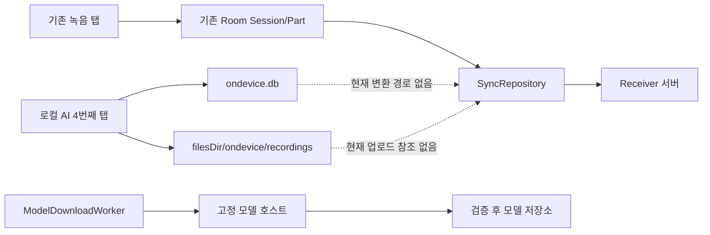

# 로컬 AI 4번째 탭 전체 QA·코드·통합 리뷰

작성 일시: `2026-07-25 KST`

검토 대상:

- [개발 계획](implement_20260725_085019.md)
- [기존 QA 실행 결과](qa_20260725_ondevice_execution.md)
- `android-app` 전체와 신규 `:feature-ondevice` 모듈

## 최종 판정

| 판정 대상 | 결과 | 판단 |
|---|---|---|
| 내부 개발·QA용 APK | **조건부 GO** | 핵심 흐름과 네이티브 엔진 smoke가 동작하고 빌드·단위 테스트가 통과함 |
| 제한된 사내 beta | **조건부 GO** | arm64 시험 단말, 데이터 비민감 조건, Qwen `실험적` 표시가 필요함 |
| 일반 사용자 production release | **NO-GO** | 라이선스 증빙, 상태 복구, 취소·삭제 경쟁, 녹음 동시성, ABI, 실동기화 0건 검증이 미완료임 |
| Qwen 기본 노출 | **NO-GO** | 독립 재계측에서 약 `52.946초`가 소요돼 `15초` 목표를 크게 초과하고 편차가 큼 |
| Moonshine 상업 배포 | **조건 충족 전 NO-GO** | 상업 사용 자체가 전면 금지는 아니지만 등록·매출 조건·고지 의무 증빙이 release 패키지에 완결되지 않음 |

결론적으로 현재 구현은 **기능 prototype/beta 수준**이다. 빌드 성공을 production
준비 완료로 해석하면 안 된다. P0/P1을 수정하고 목표 Samsung 단말 및 실제
동기화 환경에서 release gate를 다시 수행해야 한다.

## 리뷰 구성

| 역할 | 검토 범위 | 핵심 결론 |
|---|---|---|
| QA 에이전트 | Gradle, unit, lint, instrumentation, native smoke, 성능, 문서-실행 일치 | 자동 빌드는 통과했으나 사용자 복구 흐름과 실기기·성능·coverage가 release 기준 미달 |
| 코드 리뷰 에이전트 | Compose/ViewModel, 오디오, JNI, 모델 설치, 라이선스, 접근성 | 녹음·취소·삭제·프로세스 복구 경쟁과 라이선스 고지가 주요 blocker |
| 통합 리뷰 에이전트 | 기존 녹음/동기화와 로컬 AI 경계, 마이크·리소스 경쟁 | 직접 업로드 경로는 없지만 동일 프로세스 관례 경계이며 실제 서버 0건 검증이 없음 |
| 주 에이전트 | 세 결과 교차 검증, 산출물·코드·문서 대조 | production **NO-GO**, 내부 QA만 조건부 허용 |

## 검증 증거

### 자동 검증

강제 재실행:

```bash
./gradlew \
  :feature-ondevice:testDebugUnitTest \
  :app:testDebugUnitTest \
  lintDebug \
  :app:assembleDebugAndroidTest \
  :app:assembleRelease \
  --rerun-tasks
```

- 결과: `BUILD SUCCESSFUL in 1m 48s`
- Gradle: `240/240 actionable tasks executed`
- 단위 테스트: `:feature-ondevice` 18건, `:app` 33건, 총 51건 통과
- lint: error 0건, `:feature-ondevice` warning 7건, `:app` warning 74건
- release/R8: unsigned release APK 생성 성공
- 고정 native artifact·정적 network boundary task: 통과
- arm64 에뮬레이터의 선별 Compose UI 2건과 실제 `AudioRecord` smoke 1건: 통과 이력 확인
- Moonshine 공식 한국어 fixture와 Qwen 실제 생성 smoke: 통과 이력 확인

제약:

- 광범위한 독립 instrumentation 재실행에서는 두 에뮬레이터에서 테스트가 0건으로
  집계됐고 PD20 실행이 지연돼, 다중 단말 재현성 증거가 완결되지 않았다.
- native smoke는 모델/fixture가 없으면 skip될 수 있으므로 CI의 필수 release gate로
  사용하기에는 현재 조건이 느슨하다.
- JaCoCo/Kover 등 coverage 보고서가 없다.
- 목표 `SM-S931N / Android 16` 실기기가 연결되지 않았다.

### 성능 재검토

| 엔진 | 확인 결과 | 판정 |
|---|---|---|
| Moonshine Korean | 기존 공식 fixture 전사 약 `2.837초`, RTF 약 `0.41`, peak PSS 약 `350MB` | 시험 환경 통과, 목표 단말·장시간·취소 QA 필요 |
| Qwen3.5 0.8B Q4 | 기존 `20.417초`, 독립 재실행 `52.946초`, 기존 peak PSS 약 `879~900MB` | 시간 목표 실패, 편차 큼, `실험적` 유지 |

## 잘 구현된 부분

- 네 번째 Compose 탭과 별도 `:feature-ondevice` 모듈이 구성됐다.
- 로컬 AI 데이터는 별도 `ondevice.db`와 `filesDir/ondevice/recordings`를 사용한다.
- 현재 코드에서 로컬 AI 세션을 기존 `Chunk` 업로드 큐로 변환하는 직접 경로는 없다.
- Android 온디바이스 STT, Moonshine, Kotlin 추출형, Qwen 선택 구조가 구현됐다.
- 모델 GUI 다운로드·일시정지·재개·SHA-256·원자적 설치 기본 흐름이 있다.
- `MicrophoneArbiter`와 `ResourceArbiter`로 충돌을 통제하려는 구조가 있다.
- 앱 백업은 비활성화되고 파일·DB·환경설정이 백업 규칙에서 제외됐다.
- Qwen 선택지는 UI에서 `실험적`으로 표시된다.
- APK에 대형 모델 자체를 번들하지 않고 사용자가 모델 관리 화면에서 설치한다.

## 우선순위별 발견 사항

### P0 — 배포 차단

#### 1. Moonshine 상업 배포 증빙과 NOTICE 패키징 미완료

Moonshine Community License는 상업 사용을 일률적으로 금지하는 라이선스가 아니다.
다만 배포 주체의 등록, 매출 기준에 따른 사용 조건 또는 별도 계약, 정해진 고지와
`Powered by Moonshine AI` 표시 등 조건 확인이 필요하다.

현재 `Powered by Moonshine AI`와 라이선스 원문은 확인되지만 다음이 부족하다.

- 배포 주체의 상업 등록/자격 증빙
- 요구되는 Notice 문구의 독립적 제공 증거
- ONNX Runtime, Qwen, Commons Compress 등 제3자 notice의 사용자 접근 경로
- release APK/AAB에서 notice가 유지되는지 확인하는 자동 검사

또한 Gradle 패키징에서 일부 `META-INF/LICENSE*`, `META-INF/NOTICE*`를 제외하므로
의존성 고지가 소실될 수 있다. 이 항목은 법무 검토 문구만 추가해서 닫을 수 없고,
실제 배포 주체 증빙과 최종 패키지 검사가 필요하다.

### P1 — release 전 필수 수정

| ID | 문제 | 코드 수준 영향 | 필요한 수정 |
|---|---|---|---|
| P1-01 | 프로세스 종료 후 Moonshine 실패 세션의 재전사 UI가 없음 | DB는 `FAILED_RECOVERABLE`이나 화면 primary action은 재시도를 제공하지 않음 | `retryTranscription(sessionId)`와 상태별 CTA·UI test 추가 |
| P1-02 | 수동 요약 취소 상태가 불완전 | Kotlin job은 공통 취소 job에 보관되지 않고, Qwen 수동 실행은 활성 session ID가 없어 DB가 `SUMMARIZING`에 남을 수 있음 | 작업 ID·session ID를 단일 operation state로 관리하고 `finally`에서 DB 상태 확정 |
| P1-03 | 실행 중 세션 삭제 가능 | 녹음/추론 파일과 DB가 작업 중 삭제돼 native/IO race 발생 가능 | active 세션 삭제 비활성화, 취소 완료 후 삭제, 확인 dialog 추가 |
| P1-04 | `AudioRecord.startRecording()` 예외 처리 불완전 | LISTENING 상태·마이크 소유권·임시 파일이 남을 수 있음 | start/loop 전체 try/finally, 상태 rollback, 실패 instrumentation 추가 |
| P1-05 | 탭 이탈·background 직후 시작 race | UI flag가 설정되기 전 disposal이 지나가 숨은 녹음이 시작될 수 있음 | 요청 시점부터 operation token 설정, lifecycle gate와 atomic cancellation 적용 |
| P1-06 | SpeechRecognizer terminal event 유실 가능 | `MutableSharedFlow.tryEmit()` 실패가 무시돼 Final/Error가 손실되고 LISTENING 고착 가능 | terminal event는 channel/send 또는 상태 보존형 흐름 사용, overflow test 추가 |
| P1-07 | 기존 `RecorderService` 종료·복구 race | 종료 시 recorder 해제와 chunk 종료가 엇갈려 part가 `RECORDING`에 남을 수 있음 | service 내 직렬 state machine과 단일 mutex/dispatcher로 순서 보장 |
| P1-08 | 앱 시작 reconcile과 새 녹음 동시 실행 | 미완료 part 격리 중 신규 part가 quarantine될 수 있음 | reconcile 완료 barrier 뒤 ACTION_START 처리 |
| P1-09 | 로컬 AI 취소 직후 마이크 조기 양도 | `cancelAndDelete()` 완료 전 arbiter를 놓아 기존 recorder 시작이 실패할 수 있음 | 실제 `AudioRecord.release()` 완료 후 소유권 해제 |
| P1-10 | 기존 녹음의 arbiter 거부가 호출자에게 전달되지 않음 | 서비스는 알림만 띄우고 시작을 버리지만 화면은 성공으로 오인 가능 | start 결과를 상태/Room/IPC로 ViewModel에 전달 |
| P1-11 | arm64 전용 runtime과 설치 정책 불일치 | APK는 다른 ABI에 설치될 수 있으나 로컬 AI native 기능은 실행 불가 | arm64-only 배포 split 또는 runtime capability gate와 명확한 UI 제공 |
| P1-12 | Qwen native cleanup 보장 부족 | cleanup 예외를 삼키고 실제 unload 완료를 확인하지 않아 Moonshine과 메모리 중첩 위험 | native unload 계약·상태 확인, 반복 PSS test, 실패 시 프로세스 격리 검토 |
| P1-13 | 모델 삭제/설치 worker race | `cancelUniqueWork()` 직후 파일을 지워 실행 중 worker가 다시 활성화할 수 있음 | cancellation 완료 관찰 후 삭제, install/delete 공통 mutex 적용 |
| P1-14 | 모델 가져오기·다운로드 크기 상한 부족 | 잘못된 Content-Length/SAF 입력이 저장 공간을 고갈시킬 수 있음 | catalog 크기 기준 hard limit와 streaming byte counter 적용 |
| P1-15 | Qwen 성능 목표 실패 | 동일 계열 실행이 `20.417~52.946초`로 변동하고 15초 목표 초과 | 기본 비노출 또는 실험실 메뉴 유지, 목표 단말 재계측 후 별도 승인 |

핵심 코드 증거:

| 파일·라인 | 확인 내용 |
|---|---|
| `android-app/feature-ondevice/src/main/kotlin/com/thinktank/recorder/ondevice/data/OnDeviceSessionDao.kt:27-36` | process-death 상태를 `FAILED_RECOVERABLE`로 바꾸지만 UI 재전사 명령은 없음 |
| `android-app/feature-ondevice/src/main/kotlin/com/thinktank/recorder/ondevice/ui/OnDeviceViewModel.kt:295-340` | 취소·수동 요약·삭제가 서로 다른 job/session 상태를 사용함 |
| `android-app/feature-ondevice/src/main/kotlin/com/thinktank/recorder/ondevice/ui/OnDeviceViewModel.kt:390-435` | Kotlin/Qwen 요약의 cancellation·오류 상태 확정 경로가 비대칭임 |
| `android-app/feature-ondevice/src/main/kotlin/com/thinktank/recorder/ondevice/ui/OnDeviceViewModel.kt:438-513` | Moonshine 시작·중지·전사 실패 상태와 마이크 해제가 결합돼 있음 |
| `android-app/feature-ondevice/src/main/kotlin/com/thinktank/recorder/ondevice/ui/OnDeviceScreen.kt:101-128` | lifecycle disposal이 ViewModel의 실제 시작 flag보다 먼저 실행될 수 있음 |
| `android-app/feature-ondevice/src/main/kotlin/com/thinktank/recorder/ondevice/ui/OnDeviceScreen.kt:724-781` | active 삭제와 `FAILED_RECOVERABLE` 상태의 재전사 CTA 부재 |
| `android-app/feature-ondevice/src/main/kotlin/com/thinktank/recorder/ondevice/recording/LocalAudioRecorder.kt:43-110` | `startRecording()` 예외와 비동기 `cancelAndDelete()` 경계 |
| `android-app/feature-ondevice/src/main/kotlin/com/thinktank/recorder/ondevice/stt/AndroidOnDeviceSpeechEngine.kt:24-27,91-135` | 유한 buffer의 `tryEmit()` 결과를 무시해 terminal event 유실 가능 |
| `android-app/feature-ondevice/src/main/kotlin/com/thinktank/recorder/ondevice/summary/QwenSummaryEngine.kt:37-81` | cleanup 실패를 삼키며 실제 native unload 완료를 검증하지 않음 |
| `android-app/feature-ondevice/src/main/kotlin/com/thinktank/recorder/ondevice/modelpack/ModelDownloadManager.kt:36-43` | WorkManager 취소 완료를 기다리지 않고 삭제로 진행 |
| `android-app/feature-ondevice/src/main/kotlin/com/thinktank/recorder/ondevice/modelpack/ModelStore.kt:45-50` | worker와 직렬화되지 않은 모델 디렉터리 삭제 |
| `android-app/app/src/main/kotlin/com/thinktank/recorder/next/recording/RecorderService.kt:234-278` | reconcile, service 종료, recorder 해제의 순서 경쟁 |
| `android-app/app/src/main/kotlin/com/thinktank/recorder/next/recording/RecorderService.kt:383-532` | 새 part 생성·중지·상태 갱신이 lifecycle 작업과 경쟁 가능 |
| `android-app/app/src/main/kotlin/com/thinktank/recorder/next/data/repository/SyncRepository.kt:40-60` | 기존 DB의 업로드 가능 chunk만 claim하며 온디바이스 DAO를 참조하지 않음 |

### P2 — 품질·보안 증거 보강

| 항목 | 현재 문제 | 권고 |
|---|---|---|
| 다운로드 `416` | 손상된 `.part`를 보존해 Range 재시도가 반복 실패할 수 있음 | `416`에서 전체 길이·해시 확인 후 불일치하면 `.part` 폐기하고 0부터 재시작 |
| 설치 후 무결성 | marker와 파일 존재만 확인하고 매 사용 시 해시를 재검증하지 않음 | 첫 사용/주기 검사, 크기·mtime cache와 SHA-256 재검증 |
| Kotlin 요약 예외 | 예외 경로에서 `SUMMARIZING` 잔류 가능 | 모든 engine을 공통 result/finally 상태 전이로 통일 |
| Moonshine 취소 | blocking decode를 즉시 중단하지 못할 수 있음 | native cooperative cancellation 또는 별도 worker process 검토 |
| Qwen 근거성 | 제목·bullet의 원문 근거 검증이 약함 | 원문 span/문장 ID 연결, 숫자·이름·날짜 적대적 fixture 추가 |
| network 정적 검사 | `modelpack/**` 전체가 예외라 향후 일반 통신 코드가 들어가도 통과 가능 | 허용 클래스·호스트·메서드 단위 allowlist로 축소 |
| 개인정보 런타임 증거 | 코드 경계는 있으나 실제 동기화/packet 0건 test가 없음 | 로컬 세션 생성→수동/자동 sync→Receiver 요청 0건 회귀 test와 packet capture |
| 테스트 문서 | `10,000자 통과`, 광범위 resume test 등이 실제 테스트보다 과장됨 | 실제 XML/fixture 기반으로 체크박스 수정 |
| 접근성 | 일부 아이콘·진행상태·버튼의 TalkBack 의미가 약함 | contentDescription, stateDescription, traversal test 추가 |
| 로그 | native smoke에서 transcript/summary가 logcat에 노출될 수 있음 | release 및 테스트 로그에서도 사용자 콘텐츠를 마스킹 |

### P3 — 운영 개선

- lint는 error 0건이지만 warning 81건을 별도 부채로 관리한다.
- 모델·fixture가 없어도 native smoke가 성공 처리되지 않도록 release CI profile을 분리한다.
- `WAITING` 상태의 기존 예약 녹음이 물리적 마이크를 사용하지 않는 동안에도 arbiter를
  장시간 점유하는 정책을 재검토한다.
- 삭제 confirmation/undo와 모델 설치 실패의 사용자 복구 설명을 보강한다.

## 서버 연결·개인정보 경계 최종 리뷰

### 현재 데이터 흐름



현재 코드 기준으로 로컬 AI 음성·전사·요약을 `SyncRepository`에 넘기는 직접 호출,
DAO mapper, worker enqueue 경로는 발견되지 않았다. 따라서 **현 구현에서 자동 서버
업로드 대상은 아니다.**

그러나 강한 보안 격리는 아니다.

- 기존 기능과 같은 앱 UID·프로세스에서 실행된다.
- 저장소 분리는 모듈 관례와 코드 리뷰에 의존한다.
- 실제 Receiver를 연결한 상태에서 요청 0건을 증명한 자동 회귀 테스트가 없다.
- 정적 network 검사도 모델 패키지를 넓게 제외한다.

따라서 UI 문구는 앱 전체가 네트워크를 사용하지 않는다는 의미로 표현하면 안 된다.
권장 문구:

> 이 탭에서 만든 로컬 AI 음성·전사·요약은 서버에 동기화하지 않습니다.
> 기존 녹음·노트 동기화는 설정에 따라 별도로 동작합니다.

## 수정·재검증 순서

1. Moonshine 등록/매출 조건/Notice/제3자 고지 증빙을 확정한다.
2. 세션 재시도, 요약 취소, active 삭제, lifecycle start race를 수정한다.
3. 로컬 `AudioRecord`, 시스템 SpeechRecognizer, 기존 RecorderService 상태를 직렬화한다.
4. 모델 설치·삭제 mutex, byte hard limit, `416`, 설치 후 무결성을 보강한다.
5. Qwen cleanup 반복 PSS와 성능을 재검증하고 기본 노출 여부를 결정한다.
6. 로컬 세션 10건 생성 후 수동/자동 sync의 서버 요청 0건 test를 고정한다.
7. `SM-S931N / Android 16`에서 비행기 모드, 20분, 10회 반복, 강제 종료,
   저전력·thermal, 백그라운드, 화면 회전 test를 실행한다.
8. 기존 녹음→업로드→노트 흐름의 회귀를 수행한 뒤 서명 release를 생성한다.

## release 승인 기준

아래 조건이 모두 충족될 때만 production 재심사를 진행한다.

- P0 0건, P1 0건
- Moonshine 및 모든 native/model notice가 최종 APK/AAB에서 사용자 접근 가능
- 목표 Samsung 단말 필수 시나리오 통과
- Qwen을 노출할 경우 승인된 시간·메모리 기준 통과
- 모델 미설치 시 skip이 아닌 release-native 필수 테스트 통과
- 로컬 AI 생성 데이터의 Receiver 요청 0건 자동 검증 통과
- 기존 녹음·동기화 회귀 통과
- 서명 APK/AAB 설치·업데이트·rollback smoke 통과

## 이번 리뷰의 변경 범위

이번 라운드는 전체 검토와 문서 정합성 갱신만 수행했다. 위 P0/P1에 대한 제품 코드
수정은 아직 적용하지 않았다.
