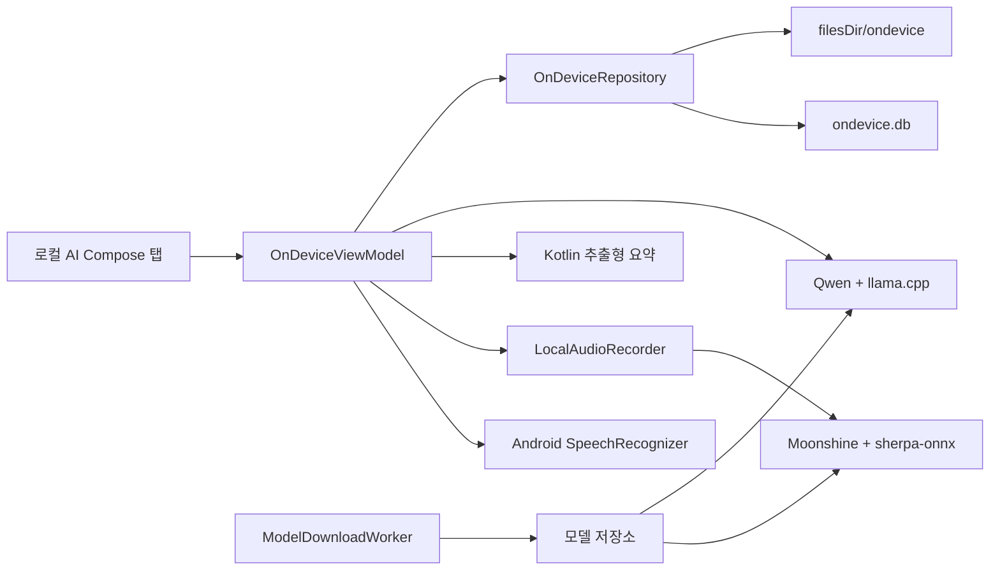
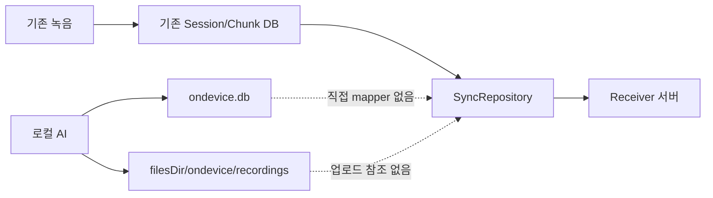

# 로컬 AI 4번째 탭 기술·기능 리뷰

작성 일시: `2026-07-25 KST`

검토 범위: Kotlin, Jetpack Compose, 로컬 녹음, 온디바이스 STT, 로컬 요약,
모델 관리, 데이터 저장, 기존 서버 동기화 경계, 성능, 테스트

> 이 문서는 라이선스, 고지, 상업 정책 등 비기술 항목을 제외한다.

후속 구현 계획:
[implement_20260725_114728.md](implement_20260725_114728.md)

## 기술 판정

| 구분 | 판정 | 설명 |
|---|---|---|
| 4번째 탭 기본 기능 | 구현됨 | Compose 탭, 엔진 선택, 세션 목록, 녹음·전사·요약 흐름 구현 |
| 로컬 데이터 분리 | 구현됨 | 별도 `ondevice.db`와 앱 전용 파일 경로 사용 |
| Android 온디바이스 STT | 부분 완료 | 지원 단말 경로 구현, 오류·취소·실기기 시나리오 보강 필요 |
| Moonshine STT | 부분 완료 | 실제 한국어 fixture 전사 성공, 복구·취소·장시간 검증 필요 |
| Kotlin 추출형 요약 | 구현됨 | 결정적 로컬 처리 가능, 장문·예외 테스트 보강 필요 |
| Qwen 로컬 요약 | 실험 기능 | 생성 성공, 실행시간·메모리·해제 안정성이 기본 기능 기준 미달 |
| 모델 관리 GUI | 부분 완료 | 다운로드·재개·검증·가져오기·삭제 구현, 경쟁·용량 제한 보강 필요 |
| 기존 서버와 분리 | 코드 구조상 분리 | 직접 업로드 경로 없음, 실제 동기화 요청 0건 자동 검증 필요 |
| 기술적 완성도 | 조건부 beta | 핵심 기능은 동작하지만 상태·동시성·복구 P1이 남아 있음 |

## 현재 구현 구조

핵심 모듈:

- `android-app/feature-ondevice`: 로컬 AI 기능 전용 Android Library
- `OnDeviceScreen`: Compose 화면과 사용자 동작
- `OnDeviceViewModel`: 녹음·전사·요약 상태 조정
- `OnDeviceRepository`: 세션과 로컬 파일 저장
- `LocalAudioRecorder`: 16kHz mono PCM WAV 녹음
- `AndroidOnDeviceSpeechEngine`: Android 시스템 로컬 STT
- `MoonshineSpeechEngine`: WAV 파일 기반 한국어 STT
- `ExtractiveSummaryEngine`: Kotlin 추출형 요약
- `QwenSummaryEngine`: Qwen 생성형 요약
- `ModelDownloadWorker`: 승인 모델 다운로드·재개·검증
- `MicrophoneArbiter`: 기존 녹음과 로컬 AI 마이크 충돌 제어
- `ResourceArbiter`: Moonshine과 Qwen native 실행 직렬화

## 기능별 상세 검토

### 1. 4번째 탭과 화면

구현:

- 기존 3개 탭에 `로컬 AI` 탭 추가
- STT와 요약 엔진을 각각 선택
- 녹음, 중지, 전사, 요약, 취소, 기록 삭제
- 모델 설치 상태와 진행률 표시
- Qwen 같은 고부하 기능 상태 표시

남은 문제:

- `FAILED_RECOVERABLE` Moonshine 세션에 재전사 버튼이 없다.
- 녹음·추론 중인 active 세션도 삭제할 수 있다.
- 화면 이탈과 작업 시작이 동시에 발생하면 취소가 시작 작업보다 먼저 끝날 수 있다.
- 일부 상태와 아이콘의 접근성 정보가 부족하다.

### 2. Android 온디바이스 STT

구현:

- API 31 이상에서 `createOnDeviceSpeechRecognizer()` 사용
- 일반 온라인 가능 SpeechRecognizer 폴백 금지
- `ko-KR` 지정
- partial, final, error event를 Flow로 변환

남은 문제:

- `MutableSharedFlow`의 `tryEmit()` 실패를 확인하지 않아 partial event가 몰리면
  final/error가 유실될 수 있다.
- final/error 유실 시 화면이 `LISTENING` 상태에 남을 수 있다.
- 지원 여부, 언어 모델 설치 여부, busy, timeout, no-match를 구분하는 실기기
  회귀 테스트가 부족하다.

개선 방향:

- terminal event는 유실되지 않는 `Channel` 또는 별도 상태 저장 구조로 처리한다.
- partial event와 terminal event의 queue를 분리한다.
- start/cancel/destroy를 단일 operation token으로 직렬화한다.

### 3. 로컬 WAV 녹음

구현:

- `AudioRecord` 기반 16kHz, mono, PCM WAV 생성
- 1초 이상 실제 녹음 smoke 통과
- 로컬 AI 전용 파일 경로 사용

남은 문제:

- `startRecording()` 예외가 발생하면 DB가 `LISTENING`에 남을 수 있다.
- 임시 파일과 마이크 소유권 정리가 모든 예외에서 보장되지 않는다.
- `cancelAndDelete()` 완료 전 `MicrophoneArbiter`를 해제할 수 있다.

개선 방향:

- 생성, 시작, read loop, WAV finalize, release를 하나의 `try/finally`로 묶는다.
- 실제 `AudioRecord.release()` 완료 후 마이크 소유권을 반환한다.
- 녹음 상태를 `STARTING → RECORDING → STOPPING → STOPPED/FAILED`로 세분화한다.

### 4. Moonshine STT

구현:

- sherpa-onnx native runtime 연결
- 한국어 모델 파일 검증과 로딩
- WAV 파일 전사 성공
- 기존 계측 RTF 약 `0.41`, peak PSS 약 `350MB`

남은 문제:

- 프로세스 종료 후 실패 세션은 복구 상태로 바뀌지만 재전사 실행 경로가 없다.
- blocking decode 도중 취소가 즉시 반영되지 않을 수 있다.
- 무음, 잡음, 저음량, 긴 녹음, 반복 실행 테스트가 부족하다.

개선 방향:

- `retryTranscription(sessionId)`를 추가한다.
- decode를 chunk 단위로 나누거나 native cancellation flag를 연결한다.
- 20분 녹음과 10회 연속 전사에서 PSS·발열·파일 복구를 측정한다.

### 5. Kotlin 추출형 요약

구현:

- 네트워크와 별도 모델 없이 실행
- 원문 문장을 선별하는 결정적 요약
- 빈 입력, 일반 입력에 대한 단위 테스트 존재

남은 문제:

- 수동 실행 job이 공통 `localOperationJob`에 저장되지 않는 경로가 있다.
- 취소나 예외에서 세션이 `SUMMARIZING`에 남을 수 있다.
- 기존 문서에 기재된 10,000자 자동 테스트는 실제로 존재하지 않는다.

개선 방향:

- 모든 요약 엔진을 동일한 `SummaryOperation` 상태 객체로 실행한다.
- 성공·실패·취소를 `finally`에서 DB 상태로 확정한다.
- 500자, 2,000자, 10,000자, 반복 문장 fixture를 추가한다.

### 6. Qwen 로컬 요약

구현:

- Qwen3.5 0.8B Q4 GGUF와 llama.cpp 연결
- 제목·핵심 요약·할 일 JSON 생성 성공
- RAM, low-memory, thermal, 배터리 사전 검사
- context와 output 크기 제한

측정 결과:

- 실행시간: 약 `20.417~52.946초`
- 기존 peak PSS: 약 `879~900MB`
- 실행별 시간 편차가 큼

남은 문제:

- 계획 기준인 15초를 충족하지 못한다.
- native cleanup 예외를 삼켜 실제 model unload 완료가 불명확하다.
- Qwen 취소 후 DB가 `SUMMARIZING`에 남을 수 있다.
- 장문, 반복 실행, low-memory 환경에서 OOM 방지 증거가 부족하다.
- 생성 내용이 원문에 근거하는지 검증하는 fixture가 부족하다.

개선 방향:

- Qwen은 기술적으로 실험 기능으로 유지한다.
- native engine에 명시적 `close()`와 unload 완료 상태를 추가한다.
- Qwen 종료 후 Moonshine 로딩을 반복하며 PSS 기준선 복귀를 확인한다.
- 입력을 Kotlin으로 먼저 압축한 후 제한된 문장만 Qwen에 전달한다.
- 생성 결과의 이름·날짜·숫자·할 일을 원문과 대조한다.

### 7. 모델 다운로드·설치

구현:

- GUI 다운로드, 일시정지, 재개, 취소, 재시도
- Range/ETag 이어받기
- 고정 URL과 호스트
- SHA-256 검증
- staging/backup 기반 설치
- SAF 파일 가져오기

남은 문제:

- HTTP `416`에서 손상된 `.part`가 유지되면 재시도 loop가 발생할 수 있다.
- 실제 수신 byte의 hard limit이 없다.
- SAF 가져오기도 예상 크기를 초과하는 stream을 끝까지 복사할 수 있다.
- `cancelUniqueWork()` 완료를 기다리지 않고 모델을 삭제한다.
- worker와 삭제가 경쟁하면 삭제한 모델이 다시 활성화될 수 있다.
- 설치 이후 marker와 파일 존재만 보고 실제 hash를 다시 확인하지 않는다.

개선 방향:

- catalog 예상 크기 기반 streaming byte hard limit을 적용한다.
- `416`에서 전체 크기·해시가 다르면 `.part`를 제거하고 처음부터 다시 받는다.
- install/download/delete를 모델 ID별 mutex로 직렬화한다.
- WorkManager cancellation 완료 후 파일을 삭제한다.
- 첫 로딩 전 설치 파일 SHA-256을 재확인한다.

### 8. 기존 녹음 기능과 마이크 통합

구현:

- 기존 `RecorderService`와 로컬 AI가 `MicrophoneArbiter`를 공유
- 동시에 마이크를 획득하는 기본 충돌 방지

남은 문제:

- 기존 녹음이 arbiter 획득에 실패해도 호출 UI는 시작 성공으로 오인할 수 있다.
- `RecorderService.onDestroy()`에서 recording job cancel과 recorder release 순서가
  경쟁해 part가 `RECORDING` 상태에 남을 수 있다.
- 앱 시작 reconcile과 신규 녹음 시작이 동시에 실행될 수 있다.
- 예약 녹음의 `WAITING` 상태가 실제 마이크를 사용하지 않으면서 arbiter를 계속
  점유할 수 있다.

개선 방향:

- 녹음 시작 결과를 Service에서 ViewModel까지 명시적으로 반환한다.
- RecorderService 상태 변경을 단일 dispatcher와 mutex에서 직렬화한다.
- reconcile 완료 barrier 뒤 신규 녹음을 허용한다.
- 물리적 마이크 사용 구간과 session 예약 상태를 분리한다.

## 서버 동기화 기술 경계

현재 구조:

확인된 내용:

- `SyncRepository`는 기존 DB의 업로드 가능한 chunk만 claim한다.
- 로컬 AI DAO, session entity, 파일 경로를 참조하지 않는다.
- 로컬 AI 세션을 기존 upload chunk로 변환하는 mapper가 없다.
- 앱 백업에서도 로컬 DB와 파일이 제외된다.

추가로 필요한 검증:

1. 로컬 AI 세션 10건을 만든다.
2. 기존 수동·자동 동기화를 실행한다.
3. 기존 upload queue 증가 여부를 확인한다.
4. mock Receiver에서 로컬 AI 관련 요청이 0건인지 검증한다.
5. 연결 상태 packet capture에서도 음성·전사·요약 전송이 없는지 확인한다.

## ABI와 단말 지원

- 로컬 native runtime은 현재 `arm64-v8a` 중심이다.
- 앱 전체에는 다른 ABI에서 설치 가능한 AndroidX native 파일이 포함될 수 있다.
- 비-arm64 단말에 앱은 설치되지만 로컬 AI native 기능은 실패할 가능성이 있다.

선택 가능한 구현:

1. 앱을 arm64 전용으로 배포한다.
2. ABI split을 사용한다.
3. 비-arm64 설치는 허용하되 Moonshine/Qwen 기능에 runtime capability gate를 둔다.

기존 녹음 기능 호환성을 유지하려면 3번이 가장 안전하지만, 로컬 AI를 필수 기능으로
정의한다면 arm64 전용 배포가 단순하다.

## 테스트 현황

| 검증 | 결과 |
|---|---|
| `:feature-ondevice:testDebugUnitTest` | 18건 통과 |
| `:app:testDebugUnitTest` | 33건 통과 |
| Gradle 강제 재실행 | `240/240`, 성공 |
| lint | error 0건, warning 81건 |
| debug/release/R8 build | 성공 |
| 선별 Compose instrumentation | 2건 통과 이력 |
| 실제 AudioRecord smoke | 1건 통과 |
| Moonshine 실제 fixture | 통과 이력 |
| Qwen 실제 생성 | 통과, 성능 기준 실패 |
| test coverage | 측정 없음 |
| 목표 Samsung 단말 | 미실행 |
| 실제 서버 요청 0건 회귀 | 미실행 |

## 기술 수정 우선순위

### 1순위 — 상태와 취소

- operation/session ID 단일화
- Moonshine 재전사
- Kotlin/Qwen 취소 후 DB 확정
- active session 삭제 차단
- lifecycle 시작·취소 race 제거

### 2순위 — 녹음 안정성

- `AudioRecord` 예외 안전성
- SpeechRecognizer terminal event 보장
- 마이크 해제 완료 후 arbiter 반환
- RecorderService 종료/reconcile/start 직렬화

### 3순위 — 모델·메모리

- 모델별 download/install/delete mutex
- byte hard limit과 `416` 복구
- 설치 후 무결성 재검증
- Qwen 명시적 unload와 반복 PSS 검증

### 4순위 — 통합 검증

- 실제 동기화 요청 0건 회귀
- 기존 녹음→업로드→노트 회귀
- arm64/비-arm64 capability test
- Samsung 실기기 장시간·강제 종료·저메모리·발열 test

## 기술적 완료 기준

- P1 상태·동시성 문제 0건
- 모든 취소·예외 후 DB가 terminal 상태로 복구
- 동시 녹음 시 양쪽 UI에 정확한 성공/실패 표시
- 모델 작업의 크기 제한·직렬화·무결성 검증 통과
- Qwen 종료 후 PSS가 승인 기준선으로 복귀
- 로컬 AI 세션의 실제 서버 요청 0건 자동 검증
- 기존 녹음과 동기화 회귀 통과
- 목표 Samsung 단말의 20분 녹음·10회 반복·강제 종료 test 통과

현재 기준으로는 **핵심 기능은 구현됐지만 상태 관리, 동시성, 네이티브 자원 해제,
실동기화 회귀가 남은 조건부 beta 단계**다.
