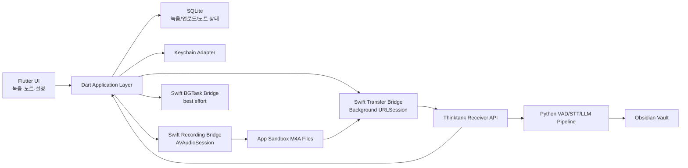

# Thinktank Recorder → Flutter iOS 전환 정밀 코드 감사

- 감사일: 2026-07-23 (Asia/Seoul)
- 대상 백엔드: `src/thinktank/`
- 대상 모바일 산출물: `thinktank-recorder.apk`
- APK SHA-256: `d3067f3210aff0c51779adfa6b66bd9621f09ac3119a5e300a577995cd8f54fb`
- APK 버전: `0.1.22+5e551a1` (`versionCode=22`)
- 판정 기준: iOS 공개 API + App Store 배포 + Flutter UI/Dart 코어 + 필요한 범위의 Swift 네이티브 브리지

## 1. 최종 판정

| 질문 | 판정 | 설명 |
|---|---|---|
| 기존 APK를 Flutter로 자동 변환할 수 있는가? | **불가** | Flutter/Kotlin 원본 프로젝트가 없고 컴파일된 APK만 있다. 디컴파일 결과는 동작 명세 복원용이지 유지보수 가능한 원본이 아니다. |
| Flutter로 iOS 앱을 새로 구현할 수 있는가? | **조건부 가능(GO)** | 수동 녹음, 청크 저장, 업로드, 노트 조회·편집은 구현 가능하다. 오디오·백그라운드 업로드·인증서 핀은 Swift 브리지가 필요하다. |
| Android와 기능을 1:1로 맞출 수 있는가? | **불가(NO-GO)** | 자동 시간 예약 마이크 시작, 부팅 후 자동 재개, 앱 강제 종료 후 워치독 복구, 시스템 통화녹음 폴더 자동 수집, APK 자체 업데이트는 iOS에 동등한 공개 API가 없다. |
| 핵심 제품 흐름을 유지할 수 있는가? | **가능** | **사용자가 녹음을 시작 → 화면 잠금 중 녹음 지속 → 파일 기반 백그라운드 업로드 → PC 처리 → 앱에서 노트 확인** 흐름으로 재정의하면 가능하다. |
| App Store 배포이 가능한가? | **조건부 가능** | 명시적 녹음 동의와 눈에 띄는 녹음 표시가 있어야 한다. 무인·은닉·예약 상시 녹음을 제품 요구사항으로 유지하면 심사 리스크가 매우 높다. |

핵심 결론은 **“변환”이 아니라 “행위 기반 재구현”**이다. 서버 파이프라인은 대부분 재사용할 수 있지만 모바일 앱은 Flutter/Swift로 새로 작성해야 한다.

## 2. 감사 범위와 신뢰도

### 2.1 실제로 확인한 항목

- Python 백엔드 소스와 테스트
- APK manifest, 권한, 컴포넌트, DEX/Kotlin 메타데이터
- APK의 앱 고유 클래스 디컴파일:
  - `MainActivity.kt`
  - `RecorderService.kt`
  - `Watchdog.kt`, `BootReceiver.kt`, `WatchdogReceiver.kt`
  - `AutoSync.kt`, `SyncWorker.kt`
  - `Sync.kt`, `Pinning.kt`
  - `NotesActivity.kt`, `NoteEditorActivity.kt`
  - `Notify.kt`
- 로컬 iOS 개발 도구 상태
- Apple 및 Flutter 공식 문서의 현재 제약

### 2.2 분석 한계

- APK에는 원본 Kotlin 프로젝트, Gradle 설정, 리소스 원본, 테스트가 포함되어 있지 않다.
- JADX 디컴파일은 일부 synthetic/generic 코드에서 오류를 냈다. 따라서 디컴파일 코드는 그대로 복사하지 않고, manifest·문자열·서버 계약과 교차 확인한 **동작 증거**로만 사용했다.
- 현재 프로젝트에는 Flutter 앱이 없으므로 `flutter analyze`, `flutter build ios`, 실기기 백그라운드 검증은 아직 수행할 수 없다.
- iOS의 마이크, 오디오 인터럽트, 화면 잠금, 백그라운드 URLSession은 시뮬레이터만으로 합격 판정할 수 없다. 물리 iPhone 검증이 필수다.

## 3. 현재 모바일 구현의 실체

### 3.1 Flutter 프로젝트가 아님

프로젝트에는 다음이 없다.

- `pubspec.yaml`
- `lib/main.dart`
- `ios/Runner.xcodeproj`
- Flutter 엔진 라이브러리/asset
- Android 원본 `.kt`/`.java`

APK는 Kotlin/AndroidX 앱이다. Flutter 바이너리가 아니다.

### 3.2 APK manifest 요약

| 항목 | 값 |
|---|---|
| 패키지 | `com.thinktank.recorder` |
| min SDK | 26 |
| target/compile SDK | 34 |
| cleartext HTTP | `usesCleartextTraffic=true` |
| 메인 화면 | `MainActivity` |
| 노트 화면 | `NotesActivity`, `NoteEditorActivity` |
| 녹음 실행 | `RecorderService`, `foregroundServiceType=microphone` |
| 재부팅 복구 | `BootReceiver` + `BOOT_COMPLETED` |
| 주기 동기화 | WorkManager |

Android 전용 핵심 권한:

- `RECORD_AUDIO`
- `FOREGROUND_SERVICE_MICROPHONE`
- `WAKE_LOCK`
- `RECEIVE_BOOT_COMPLETED`
- `USE_EXACT_ALARM`, `SCHEDULE_EXACT_ALARM`
- `REQUEST_IGNORE_BATTERY_OPTIMIZATIONS`
- `MANAGE_EXTERNAL_STORAGE`

이 권한 목록 자체가 iOS에서 1:1 포팅할 수 없는 기능 경계를 보여준다.

## 4. 코드 레벨 기능 분석

### 4.1 녹음 엔진

### 현재 Android 동작

`RecorderService.startChunk()`는 다음 설정으로 파일을 만든다.

```text
파일명: rec_yyyyMMdd_HHmmss.m4a
입력: MIC
컨테이너: MPEG-4
코덱: AAC
채널: mono
샘플레이트: 16,000 Hz
비트레이트: 32,000 bps
기본 청크: 20분
최소 청크: 5분
상태 점검: 30초마다
```

서비스는 `START_STICKY`, microphone foreground service, indefinite partial wake lock을 사용한다. `RecorderService.outputDir()`는 Android 11 이상에서 모든 파일 권한이 있으면 `/ThinktankRecorder`, 아니면 앱 전용 external files의 `recordings`를 사용한다.

### iOS/Flutter 판정

| 세부 기능 | 판정 | 구현 방향 |
|---|---|---|
| 사용자가 앱에서 녹음 시작/정지 | **가능** | Flutter UI + Swift `AVAudioSession`/`AVAudioRecorder` 또는 `AVAudioEngine` |
| M4A/AAC·mono·16 kHz·32 kbps 요청 | **가능** | 네이티브 녹음 설정으로 지정하되 실제 출력 포맷은 실기기 검증 |
| 5~N분 단위 청크 회전 | **부분 가능** | 활성 오디오 세션 동안 타이머로 파일 종료/재시작. 회전 순간 유실·오디오 라우트 변경 테스트 필요 |
| 화면 잠금 후 계속 녹음 | **부분 가능** | 사용자가 시작한 녹음에 `UIBackgroundModes=audio` 적용 |
| foreground service/고정 알림 | **동등 구현 불가** | iOS 시스템 마이크 표시 + 앱 UI/Live Activity는 보조 수단일 뿐 서비스 대체가 아님 |
| partial wake lock | **불가/불필요** | iOS에 공개 wake lock API 없음. 활성 오디오 세션의 시스템 수명주기를 따라야 함 |
| 앱 강제 종료 후 자동 재개 | **불가** | 사용자가 앱을 강제 종료하면 임의 워치독으로 마이크를 다시 켤 수 없음 |

Apple 문서는 화면 잠금 등 백그라운드 전환 뒤 녹음을 계속하려면 `UIBackgroundModes`의 `audio` 값을 사용한다고 설명한다. 다만 전화·알람·다른 비혼합 오디오 세션은 녹음을 중단시킬 수 있다: [AVAudioSession record](https://developer.apple.com/documentation/AVFAudio/AVAudioSession/Category-swift.struct/record).

### 4.2 시간 예약, 워치독, 부팅 복구

### 현재 Android 동작

`Watchdog`는 다음 조합으로 녹음 생존성을 확보한다.

1. 녹음 활성 설정이면 `RecorderService`를 다시 시작한다.
2. 15분 뒤 `AlarmManager.setExactAndAllowWhileIdle()`를 예약한다.
3. exact alarm 권한이 없으면 `setAndAllowWhileIdle()`로 후퇴한다.
4. `BootReceiver`가 `BOOT_COMPLETED`를 받으면 다시 `Watchdog.reconcile()`을 호출한다.
5. 07:00~22:00 기본 시간 창과 자정 횡단 시간 창을 지원한다.
6. 앱 화면을 다시 열어도 멈춘 서비스를 재개한다.

### iOS/Flutter 판정

| 요구 | 판정 | 이유/대안 |
|---|---|---|
| 매일 07:00에 앱이 닫힌 상태에서 마이크 자동 시작 | **불가** | iOS에는 exact alarm/boot receiver로 마이크 캡처를 시작하는 공개 API가 없음 |
| 22:00 자동 정지 | **부분 가능** | 이미 사용자 시작 녹음이 실행 중이면 앱 내부 타이머로 정지 가능. 프로세스/세션이 끝난 상태에서는 보장 불가 |
| 15분 워치독이 앱/서비스를 되살림 | **불가** | BGTask는 시스템 재량이며 정시·주기 실행 보장이 없음 |
| 재부팅 후 무인 녹음 재개 | **불가** | 사용자의 새 실행/상호작용 없이 마이크 세션을 자동 재개할 수 없음 |
| 시작 시간 알림 | **가능** | 로컬 알림으로 “녹음 시작” 유도. 사용자가 탭한 뒤 녹음 시작 |

따라서 iOS 요구사항은 아래처럼 바꿔야 한다.

```text
Android: 예약 시간에 시스템이 무인 자동 녹음
iOS: 예약 시간에 알림 → 사용자가 명시적으로 시작 → 화면 잠금 중 녹음 지속
```

App Review Guideline 2.5.4는 백그라운드 서비스를 의도된 목적으로만 사용하도록 하고, 2.5.14는 녹음에 명시적 동의와 명확한 시각/청각 표시를 요구한다: [App Review Guidelines](https://developer.apple.com/app-store/review/guidelines/).

### 4.3 통화녹음 자동 수집

### 현재 Android 동작

`Sync.callRecordingDir()`는 공용 저장소에서 다음 폴더를 탐색한다.

```text
Recordings/Call
Call
Sounds
```

Android 11 이상에서는 `MANAGE_EXTERNAL_STORAGE`가 없으면 기능을 중단한다. UI 문구도 삼성 전화 앱의 통화녹음과 모든 파일 접근 권한을 전제로 한다. `.m4a`, `.mp3`, `.wav`, `.ogg` 중 최근 기본 7일 파일을 자동 업로드한다.

### iOS/Flutter 판정

| 세부 기능 | 판정 | 설명 |
|---|---|---|
| Apple 전화 앱 통화녹음 폴더 자동 탐색 | **불가** | 타 앱/시스템 전화 앱의 비공개 컨테이너를 열거할 수 없음 |
| 전화 통화 오디오 스트림 획득 | **불가** | CallKit은 자체 VoIP 서비스를 시스템 통화 UI와 연동하는 프레임워크이지 셀룰러 전화 오디오 추출 API가 아님 |
| 사용자가 Files에서 녹음 파일 선택 | **부분 대체 가능** | Document Picker로 사용자 선택 파일/폴더에 security-scoped 접근 |
| 공유 시트로 앱에 오디오 전달 | **부분 대체 가능** | Share Extension 또는 문서 가져오기 플로우 |
| 앱 자체 VoIP 통화 녹음 | **별도 제품이면 가능성 있음** | 현재 제품의 셀룰러/삼성 통화녹음 자동 수집과는 다른 범위이며 별도 동의·정책 검토 필요 |

CallKit의 공식 용도는 앱 자체 VoIP 통화 통합이다: [CallKit](https://developer.apple.com/documentation/callkit). 사용자가 고른 외부 디렉터리는 security-scoped URL/bookmark로 접근할 수 있다: [Providing access to directories](https://developer.apple.com/documentation/uikit/providing-access-to-directories).

### 4.4 자동 동기화와 백그라운드 업로드

### 현재 Android 동작

- `AutoSync.INTERVAL_MIN = 30`
- WorkManager unique periodic work
- 연결된 네트워크 필요
- metered network면 녹음 업로드는 보류하고 노트 다운로드는 수행
- 작업 결과는 네트워크 오류가 있어도 항상 `Result.success()`
- 업로드 예외는 `Sync.uploadRecordings()` 내부에서 무시

Android 구현에도 다음 문제가 있다.

1. Worker가 항상 성공을 반환하므로 WorkManager 재시도/백오프 의미가 약해진다.
2. 예외 원인이 저장되지 않아 장애 진단이 어렵다.
3. 업로드 완료 여부를 **파일명 문자열 집합** 하나로만 관리한다.

### iOS/Flutter 판정

| 요구 | 판정 | 구현 방향 |
|---|---|---|
| 앱이 foreground일 때 즉시 동기화 | **가능** | Dart API client |
| 녹음 종료 후 이미 큐에 넣은 파일 계속 업로드 | **가능** | Swift background `URLSessionUploadTask(fromFile:)` |
| 앱 suspended/시스템 종료 중 업로드 지속 | **부분 가능** | 파일 기반 background URLSession이 담당. Dart 메모리 스트림은 사용하지 않음 |
| 정확히 30분마다 동기화 | **불가** | BGAppRefresh/BGProcessing은 시스템 재량 |
| 새 서버 노트 즉시 알림 | **부분 가능** | 현재 서버에 APNs가 없어 polling 의존. APNs를 추가해도 silent push는 보장되지 않음 |

Apple은 background session의 업로드가 파일 기반이어야 앱 종료 후에도 동작한다고 설명한다: [Downloading files in the background](https://developer.apple.com/documentation/foundation/downloading-files-in-the-background), [URLSessionUploadTask](https://developer.apple.com/documentation/foundation/urlsessionuploadtask).

권장 동기화 트리거:

1. 녹음 청크 종료 직후 background URLSession에 업로드 등록
2. 앱 foreground 진입 시 업로드 큐/노트 동기화
3. 네트워크 복구 시 큐 재평가
4. BGAppRefresh는 보너스 기회로만 사용
5. 서버가 외부 인터넷에서 APNs에 접근 가능해질 때만 push 확장 고려

### 4.5 파일 업로드 계약

### 현재 클라이언트

`Sync.uploadRecordings()`:

- 앱 녹음 `.m4a` + 선택적 통화녹음 파일을 합친다.
- `uploaded_files` SharedPreferences의 파일명 집합으로 중복을 제외한다.
- `PUT /upload/{user}/{filename}`에 원본 바이트를 보낸다.
- 성공 시 파일명만 완료 처리한다.
- 로컬 파일은 삭제하지 않는다.
- 개별 오류를 삼키고 다음 파일로 진행한다.

### 현재 서버

`src/thinktank/receiver.py`:

- `Authorization: Bearer <token>`
- 허용 오디오 확장자 검증
- 최대 2 GiB
- `Content-Length` 필수, 없으면 411
- `.thinktank.{filename}.part`에 수신 후 `os.replace`
- 동일 파일명이 이미 있으면 내용을 비교하지 않고 HTTP 200 “이미 업로드됨”
- 완료 후 150초 디바운스로 파이프라인 실행

### 전환 리스크

| 리스크 | 영향 | 수정 |
|---|---|---|
| Dart streaming 요청이 chunked encoding 사용 | 서버 411 | iOS background file upload 사용, `Content-Length` 확인 |
| 파일명만으로 중복 판정 | 다른 내용의 동명 파일 유실 가능 | UUID/sha256/size를 포함한 업로드 ledger 또는 서버 메타데이터 추가 |
| 초 단위 파일명 | 같은 초의 충돌 가능 | `rec_<timestamp>_<uuid>.m4a` |
| 클라이언트 예외 무시 | 장애 원인/재시도 상태 소실 | SQLite 큐에 attempts, nextRetryAt, lastError 저장 |
| 응답 200이면 무조건 완료 | 서버에 다른 내용이 있어도 완료 처리 | 서버가 size/hash를 검증하고 충돌 시 409 반환 |

권장 로컬 큐:

```text
recording_upload
- id UUID
- local_path
- remote_filename
- size
- sha256
- state: ready | queued | uploading | uploaded | retry | failed
- attempts
- last_error
- created_at
- uploaded_at
```

### 4.6 노트 조회·편집·삭제

### 가능한 범위

- 노트 목록/폴더 그룹: Flutter로 직접 구현 가능
- Markdown 렌더링: 가능
- `[[target]]`, `[[target|alias]]` 위키링크: custom parser로 가능
- 전체 본문 편집 후 PUT: 가능
- DELETE 후 서버의 `90-archive` 이동: 기존 계약 재사용 가능

### 확인된 기존 계약 결함: 새 노트 생성

Android:

```text
MainActivity.newNote()
→ note_yyyyMMdd_HHmmss.md 로컬 생성
→ NoteEditorActivity.save()
→ Sync.pushNote()
→ PUT /notes/{user}/{name}
```

서버:

```text
_handle_note_put()
→ _find_note()
→ 기존 NOTE_FOLDERS 안에 파일이 없으면 404 "없는 노트입니다"
```

즉 **현재 Android의 “새 노트”는 서버에 새 노트를 만들 수 없다.** 로컬 파일만 남고 PUT은 404가 된다. `downloadNotes()`가 루트의 `note_*.md`를 삭제 예외로 둔 것도 이 불일치를 우회하는 동작이다.

Flutter 전환 전에 다음 중 하나를 결정해야 한다.

1. `POST /notes/{user}` 또는 create semantics를 가진 별도 API 추가
2. 신규 노트 생성 기능을 iOS MVP에서 제거하고 서버 기존 노트 편집만 제공
3. “로컬 임시 메모 → 다음 오디오 파이프라인 입력” 같은 별도 데이터 모델로 명확히 분리

### 노트 동기화 추가 위험

- revision/ETag가 없어 PC와 폰 동시 편집 시 마지막 저장이 승리한다.
- 다운로드는 서버 내용을 로컬 파일에 즉시 덮어쓴다.
- 삭제 API가 실패하면 다음 다운로드에서 로컬 노트가 복원될 수 있다.
- 동일 파일명이 여러 서버 폴더에 있으면 `_find_note()`가 첫 항목을 사용한다.

권장 API:

```text
GET    /v1/users/{user}/notes
POST   /v1/users/{user}/notes
GET    /v1/users/{user}/notes/{id}
PUT    /v1/users/{user}/notes/{id}   If-Match: <revision>
DELETE /v1/users/{user}/notes/{id}
```

최소 변경안은 응답에 `id`, `updated_at`, `revision`을 넣고 PUT에 optimistic concurrency를 추가하는 것이다.

### 4.7 LAN, HTTP/HTTPS, 인증서 핀

### 현재 동작

- 기본 배포 안내는 `http://<PC IP>:8765`
- bearer token이 LAN 평문 HTTP로 전송될 수 있음
- HTTPS 사용 시 `sha256/<base64>` 형식 SPKI pin 필수
- Android `Pinning`은 첫 서버 인증서 공개키를 비교하지만 hostname verifier는 항상 `true`
- URL, token, user, pin은 SharedPreferences에 저장

### iOS 전환 판정

| 항목 | 판정 | 권장 |
|---|---|---|
| 같은 Wi‑Fi의 PC 접속 | **가능** | `NSLocalNetworkUsageDescription` 추가 |
| 숫자 IP의 평문 HTTP | **부분 가능/비권장** | ATS 범위를 실기기에서 확인하고 최소 예외만 사용 |
| 자체서명 TLS + SPKI pin | **가능, 네이티브 필요** | `URLSessionDelegate`/`SecTrust`에서 구성된 host에만 제한 |
| token 저장 | **가능** | Keychain 사용 |
| PC 자동 검색 | **추가 개발** | Bonjour 도입 시 `NSBonjourServices` 선언 |

Apple은 로컬 네트워크 접근 이유를 `NSLocalNetworkUsageDescription`에 선언하도록 한다: [NSLocalNetworkUsageDescription](https://developer.apple.com/documentation/bundleresources/information-property-list/nslocalnetworkusagedescription). 로컬 네트워크 ATS 설정은 [NSAllowsLocalNetworking](https://developer.apple.com/documentation/bundleresources/information-property-list/nsapptransportsecurity/nsallowslocalnetworking)을 참고하되, 광범위한 `NSAllowsArbitraryLoads`는 피한다.

보안 권장:

1. token/pin은 Keychain에 보관
2. URL host를 설정 시 확정하고 리다이렉트 시 host 변경 거부
3. 공개 CA 인증서는 기본 hostname + trust chain 검증 후 추가 pin
4. 자체서명 인증서는 “특정 host + 특정 SPKI” 범위에서만 예외 처리
5. pin 교체를 위해 현재/다음 pin 2개를 허용하는 회전 절차 추가

### 4.8 앱 업데이트

현재 Android는 `/apk/info`를 조회하고 `/apk?token=...`을 브라우저로 연다.

| 요구 | iOS 판정 |
|---|---|
| 앱이 IPA를 내려받아 자체 설치 | **불가(App Store)** |
| 새 버전 확인 | **가능** |
| 업데이트 이동 | App Store/TestFlight/MDM 링크로 교체 |
| `/apk`, `/apk/info` 재사용 | iOS에는 의미 없음 |

App Store 배포이면 App Store 버전 확인/업데이트 화면으로 바꾼다. 사내 전용이면 Apple Developer Enterprise Program 또는 MDM 정책 범위를 별도 검토한다.

## 5. 불가 항목 상세 목록

| ID | 불가 항목 | 직접 원인 | 허용 가능한 대체 |
|---|---|---|---|
| N-01 | APK → Flutter 자동 변환 | 컴파일 바이너리뿐이며 Flutter 원본 없음 | 기능 명세 기반 clean-room 재구현 |
| N-02 | 매일 예약 시각 무인 마이크 시작 | exact alarm/boot receiver/foreground service에 대응하는 iOS 공개 API 없음 | 로컬 알림 후 사용자 탭으로 시작 |
| N-03 | 강제 종료/재부팅 뒤 자동 녹음 재개 | iOS 앱 수명주기·프라이버시 제약 | 앱 재실행 시 상태 복구 안내 |
| N-04 | 15분 워치독으로 지속적 서비스 부활 | BGTask 실행 시간/주기 보장 없음 | active recording 상태 감시 + foreground 복구 |
| N-05 | 시스템 전화 앱 통화녹음 폴더 자동 읽기 | 앱 sandbox, 전화 오디오/폴더 공개 API 없음 | Files/공유 시트 수동 가져오기 |
| N-06 | 모든 파일 접근 | iOS에 Android식 `MANAGE_EXTERNAL_STORAGE` 없음 | 앱 sandbox + Document Picker |
| N-07 | partial wake lock | 공개 wake lock API 없음 | 올바른 audio background mode |
| N-08 | 정확히 30분 주기 WorkManager 동등 동작 | iOS background scheduling은 시스템 재량 | event-driven queue + foreground + opportunistic BGTask |
| N-09 | `/apk` 자체 업데이트 | App Store 앱은 임의 IPA 설치 불가 | App Store/TestFlight/MDM |

## 6. 부분 가능 항목 상세 목록

| ID | 부분 가능 항목 | 가능한 조건 | 남는 제약 |
|---|---|---|---|
| P-01 | 장시간 백그라운드 녹음 | 사용자가 시작, 마이크 권한, `UIBackgroundModes=audio` | 전화/알람/라우트 변경, 강제 종료, 심사 검토 |
| P-02 | 청크 회전 | 녹음 세션과 프로세스가 활성 | 경계 유실·회전 실패 복구 필요 |
| P-03 | 백그라운드 업로드 | 먼저 로컬 파일 생성 후 background URLSession 등록 | 임의 Dart 코드의 계속 실행은 불가 |
| P-04 | 자동 동기화 | foreground/네트워크 복구/시스템이 준 BGTask 기회 | 30분 및 즉시성 보장 불가 |
| P-05 | 새 노트 알림 | 앱이 polling 중 신규 노트를 실제로 확인 | 서버 push 없음, 백그라운드 polling 불확실 |
| P-06 | 통화녹음 유입 | 사용자가 오디오를 직접 선택/공유 | 시스템 통화 폴더 자동 탐색 불가 |
| P-07 | 외부 폴더 접근 | 사용자가 Document Picker로 폴더 선택 | security-scoped 수명주기 관리 필요 |
| P-08 | LAN HTTP | 로컬 네트워크 권한과 ATS 설정 | bearer 평문 노출, IP/네트워크 변경 |
| P-09 | SPKI pin | Swift trust challenge 구현 | 자체서명/host 검증/회전 설계 필요 |
| P-10 | 노트 양방향 편집 | 기존 노트에 한정 | 신규 생성 404, revision 없음 |
| P-11 | 녹음 완료 알림/상태 UI | 앱이 실행 중이거나 시스템 이벤트 전달 | Android foreground notification과 동일하지 않음 |

## 7. 직접 구현 가능한 항목

- Flutter 설정/상태/노트 화면
- 수동 녹음 시작·정지 UI
- 앱 sandbox의 M4A 파일 관리
- 수동 업로드 및 연결 확인
- bearer 인증 API 호출
- 노트 목록, 폴더 그룹, Markdown 렌더링
- 위키링크 파싱과 앱 내부 탐색
- 기존 노트 편집/업데이트
- 노트 삭제 요청과 서버 archive 결과 표시
- 로컬 알림
- 업로드/동기화 큐와 오류 이력
- 서버 Python 처리 파이프라인 재사용

## 8. 권장 Flutter/iOS 아키텍처



### 8.1 Flutter 책임

- 화면, 내비게이션, 입력 검증
- 녹음 상태 표시
- 노트 목록/Markdown/editor
- domain model과 repository
- SQLite 상태/재시도 정책
- foreground 동기화 orchestration

### 8.2 Swift 책임

- `AVAudioSession` 설정과 interruption/route-change 처리
- background audio recording
- 파일 청크 회전의 네이티브 이벤트
- background `URLSession` 생성·복원·delegate
- TLS trust challenge와 SPKI pin
- Keychain
- BGTask 등록/만료 처리
- Document Picker와 security-scoped bookmark

### 8.3 권장 모듈 경계

```text
mobile/
  lib/
    app/
    core/
      database/
      networking/
      secure_storage/
    features/
      recording/
      upload_queue/
      notes/
      settings/
  ios/
    Runner/
      RecordingBridge.swift
      BackgroundTransferBridge.swift
      PinnedTrustDelegate.swift
      BackgroundTaskBridge.swift
      DocumentPickerBridge.swift
```

오디오와 백그라운드 전송을 순수 Dart 패키지 하나에 전적으로 맡기지 않는다. 앱 종료/재연결 delegate, signing capability, trust challenge는 Swift에서 명확히 소유하는 편이 검증 가능하다.

## 9. 백엔드 필수/권장 수정

### P0 — Flutter 착수 전

1. **신규 노트 정책 확정**
   - create API를 추가하거나 iOS MVP에서 새 노트 버튼 제거
2. **업로드 충돌 계약 수정**
   - 동명 파일의 size/hash가 다르면 409
3. **API 계약 테스트 고정**
   - URL encoding, `Content-Length`, 200/201/409/411/413/507, 한글 파일명
4. **iOS 버전 API 분리**
   - `/apk` 로직을 iOS 코드에 가져오지 않음

### P1 — 안정화

1. API `/v1` 버전 도입
2. note id/revision/updated_at 추가
3. 업로드 manifest 또는 idempotency key
4. 오류 JSON 표준화
5. pin 회전 절차
6. 파일 처리 완료 상태 조회 API

### P2 — 즉시 알림이 필요할 때

1. device registration API
2. APNs provider
3. 사용자별 device token 수명주기
4. 파이프라인 완료 이벤트와 visible notification

단, Apple은 background/silent notification 전달을 보장하지 않는다: [Pushing background updates to your app](https://developer.apple.com/documentation/usernotifications/pushing-background-updates-to-your-app).

## 10. 권장 제품 요구사항

### iOS MVP에 포함

- 사용자가 누르는 녹음 시작/정지
- 화면 잠금 중 계속 녹음
- 20분 기본 청크
- 녹음 종료 즉시 파일 업로드 큐 등록
- 연결 복구/앱 재실행 시 업로드 재개
- 노트 목록/보기/기존 노트 편집
- 서버 연결/토큰/pin 설정
- 로컬 녹음 상태와 명확한 마이크 표시

### iOS MVP에서 제외

- 무인 예약 녹음 시작
- 부팅/강제 종료 후 자동 녹음
- 시스템 통화녹음 자동 수집
- 모든 파일 접근
- 정확한 30분 polling
- 앱 자체 설치/업데이트
- 서버 신규 노트 create API가 없을 때의 “새 노트”

### 2차 대체 기능

- 예약 시간 로컬 알림
- Files/공유 시트 오디오 가져오기
- App Store 업데이트 이동
- APNs 완료 알림
- Bonjour PC 자동 탐색

## 11. 검증 게이트

### Gate A — 3~5일 기술 PoC

물리 iPhone에서 다음을 통과해야 본 개발 GO다.

1. M4A 16 kHz mono 장시간 녹음
2. 화면 잠금 2시간 동안 20분 청크 6개 생성
3. 청크 경계 음성 유실 측정
4. Wi‑Fi 단절 후 background file upload 재개
5. self-signed TLS + SPKI pin 성공/불일치 차단
6. 전화 수신/알람/AirPods 연결 변경 후 녹음 상태 복구
7. 앱 강제 종료 시 사용자에게 정확한 제한 안내

### Gate B — API 계약

1. 한글·공백 파일명 URL encoding
2. 0 byte, 최대 크기, 2 GiB 초과
3. 같은 이름·같은 내용 재전송
4. 같은 이름·다른 내용 충돌
5. 401, 411, 413, 507
6. 중간 연결 해제 후 `.part` 정리
7. note 404/create/update/delete/revision

### Gate C — 배포

1. `flutter doctor -v`
2. Xcode first-launch 완료
3. Apple signing/team/provisioning
4. physical device archive
5. microphone/local network/notification permission 문구
6. App Review용 백그라운드 녹음 설명과 녹음 표시 증거

## 12. 로컬 개발 환경 상태

| 항목 | 상태 |
|---|---|
| Xcode | 26.2 설치됨 |
| iOS Simulator runtime | 26.2 설치됨 |
| CocoaPods | 1.16.2 설치됨 |
| Flutter SDK | **없음** |
| Dart SDK | **없음** |
| Xcode first-launch | **미완료 상태 확인** |
| Flutter 프로젝트 | **없음** |
| Apple signing/physical device | 이번 감사에서 미검증 |

따라서 “개발 가능한 Mac”의 기반은 있으나, 현재 상태에서 바로 iOS build를 실행할 수는 없다.

## 13. 예상 일정

1인 숙련 개발자 기준의 거친 범위이며 PoC 결과에 따라 변한다.

| 단계 | 예상 |
|---|---:|
| PoC·API 계약 보완 | 1주 |
| Flutter 앱 골격·설정·노트 | 1~2주 |
| Swift 녹음/인터럽트/청크 | 2~3주 |
| background upload/TLS pin/queue | 2주 |
| 실기기 안정화·배포 준비 | 2~4주 |
| 합계 | **8~12주** |

자동 예약 녹음과 통화녹음 자동 수집을 “동일 기능”으로 요구하면 일정 문제가 아니라 **플랫폼 불가 판정**이 된다.

## 14. 현재 프로젝트 검증 결과

- Python 테스트: `549 passed, 4 skipped, 4 deselected`
- Ruff: 통과
- Python compileall: 통과
- APK manifest/DEX 구조: 확인
- Flutter analyze/build: Flutter 프로젝트와 SDK가 없어 미수행
- iOS 실기기 테스트: 미수행

## 15. 최종 의사결정

### GO 조건

- iOS 녹음은 사용자가 명시적으로 시작한다.
- 백그라운드는 “시작된 녹음의 지속”과 “등록된 파일 업로드의 지속”으로 한정한다.
- 통화녹음은 Files/공유 시트 수동 가져오기로 바꾼다.
- 30분 정확 동기화 대신 event-driven/best-effort 모델을 수용한다.
- 새 노트 404와 업로드 충돌 계약을 먼저 수정한다.

### NO-GO 조건

- 앱이 닫혀 있어도 매일 정시에 무인 마이크를 켜야 한다.
- 재부팅/강제 종료 후 사용자의 행동 없이 녹음을 되살려야 한다.
- Apple 전화 앱 통화녹음을 자동 탐색·수집해야 한다.
- Android APK 업데이트와 같은 자체 설치가 필수다.

**권고:** iOS 전용 요구사항을 위 GO 조건으로 확정한 뒤, Gate A PoC부터 진행한다. PoC가 통과하면 현재 Python 서버를 유지하면서 Flutter iOS MVP 개발을 시작할 수 있다.
